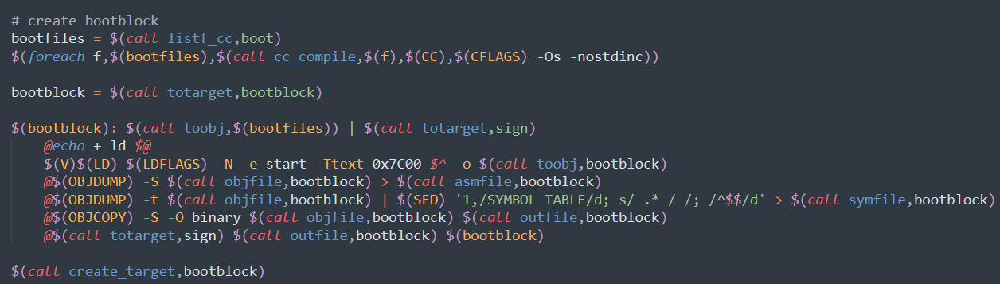

# 实验报告lab1  
## 练习一  
### 1. 操作系统镜像文件ucore.img是如何一步一步生成的？(需要要比较详细地解释Makefile中每一条相关命令和命令参数的含义，以及说明命令导致的结果)

根据ucore的生成截图可知如果要生成ucore.img我们需要kernel和bootblock这两个块。    

dd是一条linux命令指令：用指定大小的块拷贝一个文件，并在拷贝的同时进行指定的转换。  
if=文件名：输入文件名，缺省为标准输入。即指定源文件。< if=input file >  
of=文件名：输出文件名，缺省为标准输出。即指定目的文件。< of=output file >  
seek=blocks：从输出文件开头跳过blocks个块后再开始复制。  
conv=conversion：用指定的参数转换文件。   
count=blocks：仅拷贝blocks个块，块大小等于ibs指定的字节数。    
这段代码意思就是创建10000字节的内存块，然后将bootblock和kernel拷贝进去。  
查看kernel和bootblock生成过程：   


分析同上
makefile通过找到生成kernel，bootblock两个elf文件的依赖文件，然后执行linux下的指令层层编译生成。
>在虚拟机编译使用make "V="后

根据make V=的输出知道编译过程，是层层编译最后组合dd命令生成的elf文件，生成镜像文件。ucore.img生成需要先生成kernel和bootblock两个块然后，执行makefile中写好的指令也就是dd开始的拷贝，最后生成。结合实验手册发现先拷贝的第一个块是bootblock，然后拷贝kernel，正好说明了机器启动过程到操作系统运行首先读取硬盘主引导扇区到内存然后跳到对应内存bootloader先执行，然后才是操作系统内核kernel。也就是先执行boot再执行kernel。     


### 2. 一个被系统认为是符合规范的硬盘主引导扇区的特征是什么？
根据实验手册知道：       
sign.c：一个C语言小程序，是辅助工具，用于生成一个符合规范的硬盘主引导扇区。      
查看sign.c源代码：
``` C
    char buf[512];
    memset(buf, 0, sizeof(buf));
    FILE *ifp = fopen(argv[1], "rb");
    int size = fread(buf, 1, st.st_size, ifp);
    if (size != st.st_size) {
        fprintf(stderr, "read '%s' error, size is %d.\n", argv[1], size);
        return -1;
    }
    fclose(ifp);
    buf[510] = 0x55;
    buf[511] = 0xAA;
    FILE *ofp = fopen(argv[2], "wb+");
    size = fwrite(buf, 1, 512, ofp);
    if (size != 512) {
        fprintf(stderr, "write '%s' error, size is %d.\n", argv[2], size);
        return -1;
    }
    fclose(ofp);
    printf("build 512 bytes boot sector: '%s' success!\n", argv[2]);
    return 0;
```
sign是辅助生成bootblock的
```Makefile
    bootfiles = $(call listf_cc,boot)
    $(foreach f,$(bootfiles),$(call cc_compile,$(f),$(CC),$(CFLAGS) -Os -nostdinc))

    bootblock = $(call totarget,bootblock)

    $(bootblock): $(call toobj,$(bootfiles)) | $(call totarget,sign)
        @echo + ld $@
        $(V)$(LD) $(LDFLAGS) -N -e start -Ttext 0x7C00 $^ -o $(call toobj,bootblock)
        @$(OBJDUMP) -S $(call objfile,bootblock) > $(call asmfile,bootblock)
        @$(OBJDUMP) -t $(call objfile,bootblock) | $(SED) '1,/SYMBOL TABLE/d; s/ .* / /; /^$$/d' > $(call symfile,bootblock)
        @$(OBJCOPY) -S -O binary $(call objfile,bootblock) $(call outfile,bootblock)
        @$(call totarget,sign) $(call outfile,bootblock) $(bootblock)

    $(call create_target,bootblock)
```
会发现最后sign.c代码中buf最后两个字节是0x55和0xAA这两个字节用作引导区标记，符合规范的硬盘主引导扇区的大小是512个字节，其中最后两个字节分别是0x55，0xAA。

## 练习二
### 1. 从CPU加电后执行的第一条指令开始，单步跟踪BIOS的执行。
根据实验手册知道BIOS是一段储存在固件中的代码，用来做计算机硬件的自检和初始化。BIOS运行在实模式下，该模式下的地址是16位偏移量加上4位段基址。在8086PC机中，任意时刻，设CS中的内容为Ｍ，IP中的内容为Ｎ，8086CPU将从内存（M＊16）+N单元开始，读取一条指令并执行。手册中指出CS和IP分别是0xF000和0xFFF0，第一条指令就存在0xFFFF0这个地址中，这个地址存放的是跳转指令，会跳转到CS和IP分别位0xF000和0xE05B这个地址，从这里开始执行BIOS的代码。


BIOS查看汇编代码，首先需要将gdbinit文件中断点break kernel和continue删除


这样make debug命令执行后就会停在0xffff0这个地址，使用x/i调试接下来跳转后的地址内容0xf000e05b如下截图。


### 2.在初始化位置0x7c00设置实地址断点,测试断点正常。
根据makefile链接时相关指令：

```Makefile
bootfiles = $(call listf_cc,boot)
$(foreach f,$(bootfiles),$(call cc_compile,$(f),$(CC),$(CFLAGS) -Os -nostdinc))

bootblock = $(call totarget,bootblock)

$(bootblock): $(call toobj,$(bootfiles)) | $(call totarget,sign)
    @echo + ld $@
    $(V)$(LD) $(LDFLAGS) -N -e start -Ttext 0x7C00 $^ -o $(call toobj,bootblock)
    @$(OBJDUMP) -S $(call objfile,bootblock) > $(call asmfile,bootblock)
    @$(OBJDUMP) -t $(call objfile,bootblock) | $(SED) '1,/SYMBOL TABLE/d; s/ .* / /; /^$$/d' > $(call symfile,bootblock)
    @$(OBJCOPY) -S -O binary $(call objfile,bootblock) $(call outfile,bootblock)
    @$(call totarget,sign) $(call outfile,bootblock) $(bootblock)

$(call create_target,bootblock)
```
以及bootasm.S中的注释内容：
>#Start the CPU: switch to 32-bit protected mode, jump into C.     
>#The BIOS loads this code from the first sector of the hard disk into    
>#memory at physical address 0x7c00 and starts executing in real mode    
>#with %cs=0 %ip=7c00.

知道0x7c00是bootloader代码要被加载的位置      
修改gdbinit内容       
        
将断点设置在0x7c00的位置，运行make debug    
    
调试最后一行出现The target architecture is assumed to be i386说明测试断点正常    
### 3. 从0x7c00开始跟踪代码运行,将单步跟踪反汇编得到的代码与bootasm.S和bootblock.asm进行比较。
首先修改gdbinit文件       
     
在0x7c00进行调试得到汇编指令如下图所示       
     
查看bootasm.S中的代码：    
       
查看bootblock.asm中的代码：    
     
对比发现反汇编指令与两个汇编指令文件中的指令是相同的。          
### 4. 自己找一个bootloader或内核中的代码位置，设置断点并进行测试。
断点在gdbinit文件中设置为kernel_init中，测试结果如图：     
       
## 练习三
### BIOS将通过读取硬盘主引导扇区到内存，并转跳到对应内存中的位置执行bootloader。请分析bootloader是如何完成从实模式进入保护模式的。
首先我们需要了解一些基础知识：       
8088/8086机器只有20位地址线，而后来的发展扩展的地址空间所需要的地址线已经超过了20位的地址线，本实验采用机器80386，32位地址线，为了实现向下兼容，采用了实模式和保护模式，为了实现这种转换采用了控制第20号位的方法，这样当这一位为0的时候在实模式下访问的空间不超过1M和以前的机器一样，当在保护模式下，访问的地址空间都是奇数兆。        
为了实现这种转换IBM公司采用了一个键盘控制器（是一个8042的芯片），这个芯片里面有4个寄存器分别为INPUT，OUTPUT，STATUS，CONTROL。还有两个端口地址就是代码中的60H，和64H。60H负责读写缓冲区的数据，64H负责接收指令，8042还有3个内部端口：Input Port、Output Port和Test Port，这三个端口的操作都是通过向64h发送命令，然后在60h进行读写的方式完成，比如我们要转换实模式到保护模式就需要把A20Gate打开，打开方式就是第20位改为1，这个时候通过键盘控制器64H端口接收写命令，把数据从60H端口写进去。查看bootasm.S代码：       
           
注释如图        
这是转换前的准备工作：
```
    # Enable A20:
    #  For backwards compatibility with the earliest PCs, physical
    #  address line 20 is tied low, so that addresses higher than
    #  1MB wrap around to zero by default. This code undoes this.
seta20.1:
    inb $0x64, %al                                  # Wait for not busy(8042 input buffer empty).
    testb $0x2, %al
    jnz seta20.1

    movb $0xd1, %al                                 # 0xd1 -> port 0x64
    outb %al, $0x64                                 # 0xd1 means: write data to 8042's P2 port

seta20.2:
    inb $0x64, %al                                  # Wait for not busy(8042 input buffer empty).
    testb $0x2, %al
    jnz seta20.2

    movb $0xdf, %al                                 # 0xdf -> port 0x60
    outb %al, $0x60                                 # 0xdf = 11011111, means set P2's A20 bit(the 1 bit)to 1
```
这个是转换操作，过程如上解析
接下来就转换到了保护模式下          
         
lgdt用来设置gdtr（保存GDT大小（size代表大小）与地址（32位线性地址）的寄存器）描述GDT的信息在最后两行，GDT的信息在gdt中，这三行代表设置NULL段，代码段和数据段。跟在lgdt之后的代码设置cr0寄存器实现从实模式到保护模式的转换。     
```
.set PROT_MODE_CSEG,        0x8                     # kernel code segment selector
.set PROT_MODE_DSEG,        0x10                    # kernel data segment selector
.set CR0_PE_ON,             0x1                     # protected mode enable flag
```
这个是段选择子，利用段选择子来寻找到GDT条目
利用ljmp跳转到指定protcseg地址。      
接着设置好各个段寄存器。      
```protcseg:
    # Set up the protected-mode data segment registers
    movw $PROT_MODE_DSEG, %ax                       # Our data segment selector
    movw %ax, %ds                                   # -> DS: Data Segment
    movw %ax, %es                                   # -> ES: Extra Segment
    movw %ax, %fs                                   # -> FS
    movw %ax, %gs                                   # -> GS
    movw %ax, %ss                                   # -> SS: Stack Segment
```
最后调用bootmain，至此完成从实模式到保护模式下的转换。       
```
    # Set up the stack pointer and call into C. The stack region is from 0--start(0x7c00)
    movl $0x0, %ebp
    movl $start, %esp
    call bootmain
    # If bootmain returns (it shouldn't), loop.
spin:
    jmp spin
```
## 练习4：分析bootloader加载ELF格式的OS的过程。（要求在报告中写出分析）
查看bootmain.c源码      
``` c
void
bootmain(void) {
    // read the 1st page off disk
    readseg((uintptr_t)ELFHDR, SECTSIZE * 8, 0);

    // is this a valid ELF?
    if (ELFHDR->e_magic != ELF_MAGIC) {
        goto bad;
    }

    struct proghdr *ph, *eph;

    // load each program segment (ignores ph flags)
    ph = (struct proghdr *)((uintptr_t)ELFHDR + ELFHDR->e_phoff);
    eph = ph + ELFHDR->e_phnum;
    //按照程序头表的描述，将ELF文件中的数据载入内存
    for (; ph < eph; ph ++) {
        readseg(ph->p_va & 0xFFFFFF, ph->p_memsz, ph->p_offset);
    }

    // call the entry point from the ELF header
    // note: does not return
    //根据ELF头表中的入口信息，找到内核的入口并开始运行 
    ((void (*)(void))(ELFHDR->e_entry & 0xFFFFFF))();

bad:
    outw(0x8A00, 0x8A00);
    outw(0x8A00, 0x8E00);

    /* do nothing */
    while (1);
}
```
首先读取第一个扇区，然后判断是否是一个有效的ELF，然后加载接下来的扇区，之后再调用了elf文件头中定义的入口地址处的函数代码。
### 1. bootloader如何读取硬盘扇区的？
查看readsect函数源码：    
```c
/* readsect - read a single sector at @secno into @dst */
static void
readsect(void *dst, uint32_t secno) {
    // wait for disk to be ready
    waitdisk();

    outb(0x1F2, 1);                         // count = 1
    outb(0x1F3, secno & 0xFF);
    outb(0x1F4, (secno >> 8) & 0xFF);
    outb(0x1F5, (secno >> 16) & 0xFF);
    outb(0x1F6, ((secno >> 24) & 0xF) | 0xE0);
    outb(0x1F7, 0x20);                      // cmd 0x20 - read sectors

    // wait for disk to be ready
    waitdisk();

    // read a sector
    insl(0x1F0, dst, SECTSIZE / 4);
}

/* *
 * readseg - read @count bytes at @offset from kernel into virtual address @va,
 * might copy more than asked.
 * */
static void
readseg(uintptr_t va, uint32_t count, uint32_t offset) {
    uintptr_t end_va = va + count;

    // round down to sector boundary
    va -= offset % SECTSIZE;

    // translate from bytes to sectors; kernel starts at sector 1
    uint32_t secno = (offset / SECTSIZE) + 1;

    // If this is too slow, we could read lots of sectors at a time.
    // We'd write more to memory than asked, but it doesn't matter --
    // we load in increasing order.
    for (; va < end_va; va += SECTSIZE, secno ++) {
        readsect((void *)va, secno);
    }
}
```
readsect函数是被readseg里面调用的一个函数,在readsect里面出现了很多地址。查阅资料如下：      
0x1f0 读数据，当0x1f7不为忙状态时，可以读。

0x1F3 R/W，数据寄存器

0x1F2 R/W，扇区数寄存器，记录操作的扇区数

0x1F3 R/W，扇区号寄存器，记录操作的起始扇区号

0x1F4 R/W，柱面号寄存器，记录柱面号的低 8 位

0x1F5 R/W，柱面号寄存器，记录柱面号的高 8 位

0x1F6 R/W，驱动器/磁头寄存器，记录操作的磁头号，驱动器号，和寻道方式，前 4 位代表逻辑扇区号的高 4 位，DRV = 0/1 

代表主/从驱动器，LBA = 0/1 代表 CHS/LBA 方式

0x1F7 R，状态寄存器，第 6、7 位分别代表驱动器准备好，驱动器忙

0x1F8 W，命令寄存器，0x20 命令代表读取扇区

分析readsect代码如下：       
首先设置读取扇区的数目为1，然后接下来的四行代码表示，这四个字节构成的32位参数中，29-31位被强制设为1，第28位被设置为0表示访问Disk0.0-27位表示28位的偏移量，接下来的一行代码表示读取扇区，最后一行代码表示从0x1F0开始读取SECTSIZE字节数到dst的位置,每次读四个字节，读取 SECTSIZE/ 4次。          
### 2. bootloader是如何加载ELF格式的OS？
查看bootmain.c源码看elfhdr、proghdr相关的信息
```c
struct elfhdr {
  uint magic;  // must equal ELF_MAGIC
  uchar elf[12];
  ushort type;
  ushort machine;
  uint version;
  uint entry;  // 程序入口的虚拟地址
  uint phoff;  // program header 表的位置偏移
  uint shoff;
  uint flags;
  ushort ehsize;
  ushort phentsize;
  ushort phnum; //program header表中的入口数目
  ushort shentsize;
  ushort shnum;
  ushort shstrndx;
};
```
```
struct proghdr {
  uint type;   // 段类型
  uint offset;  // 段相对文件头的偏移值
  uint va;     // 段的第一个字节将被放到内存中的虚拟地址
  uint pa;
  uint filesz;
  uint memsz;  // 段在内存映像中占用的字节数
  uint flags;
  uint align;
};
```
## 练习5：实现函数调用堆栈跟踪函数 （需要编程）
编写print_stackframe代码如下
```c
void
print_stackframe(void) {
    uint32_t ebp = read_ebp(), eip = read_eip();

    int i, j;
    for (i = 0; ebp != 0 && i < STACKFRAME_DEPTH; i ++) {
        cprintf("ebp:0x%08x eip:0x%08x args:", ebp, eip);
        uint32_t *args = (uint32_t *)ebp + 2;//指针加2意味着ebp+8就是参数位置
        for (j = 0; j < 4; j ++) {
            cprintf("0x%08x ", args[j]);
        }
        cprintf("\n");
        print_debuginfo(eip - 1);
        eip = ((uint32_t *)ebp)[1];  //返回地址给了eip也就是当前ebp+4的位置
        ebp = ((uint32_t *)ebp)[0];   //返回当初的ebp
    }
}
```
函数调用栈，会首先将参数返回地址从上往下保存，然后在返回地址下方保存旧的ebp，之后将新的ebp和esp指向当前旧的ebp，然后esp在减去一些空间，留给函数栈，同时留了一些空间给局部变量，也就是旧ebp下方。所以代码中for循环的最后两行就是不断返回原ebp和函数返回后要执行的下一条指令执行地址给eip。

运行后的截图     
      
## 练习6：完善中断初始化和处理 （需要编程）
### 1. 中断描述符表（也可简称为保护模式下的中断向量表）中一个表项占多少字节？其中哪几位代表中断处理代码的入口？

一个表项占8个字节64位。中断处理代码入口地址通过gd_ss段选择子找到段基址然后加上+gd_off_31_16（高16位的段内偏移）<<16+gd_off_15_0（低16位的段内偏移）得到。
```c
struct gatedesc {
    unsigned gd_off_15_0 : 16;        // low 16 bits of offset in segment
    unsigned gd_ss : 16;            // segment selector
    unsigned gd_args : 5;            // # args, 0 for interrupt/trap gates
    unsigned gd_rsv1 : 3;            // reserved(should be zero I guess)
    unsigned gd_type : 4;            // type(STS_{TG,IG32,TG32})
    unsigned gd_s : 1;                // must be 0 (system)
    unsigned gd_dpl : 2;            // descriptor(meaning new) privilege level
    unsigned gd_p : 1;                // Present
    unsigned gd_off_31_16 : 16;        // high bits of offset in segment
};
```
### 2. 请编程完善kern/trap/trap.c中对中断向量表进行初始化的函数idt_init。在idt_init函数中，依次对所有中断入口进行初始化。使用mmu.h中的SETGATE宏，填充idt数组内容。每个中断的入口由tools/vectors.c生成，使用trap.c中声明的vectors数组即可。
```c
    extern uintptr_t __vectors[];
    int i;
    for (i = 0; i < sizeof(idt) / sizeof(struct gatedesc); i ++) {
        SETGATE(idt[i], 0, GD_KTEXT, __vectors[i], DPL_KERNEL);
    }
    // set for switch from user to kernel
    SETGATE(idt[T_SWITCH_TOK], 0, GD_KTEXT, __vectors[T_SWITCH_TOK], DPL_USER);
    // load the IDT
    lidt(&idt_pd);
```
代码编写首先引入中断处理函数的入口地址__vectors[],这个变量在vector.s里面生成的
，然后初始化idt中断描述符表，使用SETGATE这个宏进行段选择符的构造。     
查看SETGATE内容：      
   
gate：为相应的idt数组内容，处理函数的入口地址

istrap：系统段设置为1，中断门设置为0

sel：段选择子，这里是GO——KTEXT

#define GD_KTEXT    ((SEG_KTEXT) << 3)        // kernel text

off：为__vectors数组内容，存在vectors.s中，支持256个中断

dpl：设置优先级，0为内核级，3为用户级        
### 3. 请编程完善trap.c中的中断处理函数trap，在对时钟中断进行处理的部分填写trap函数中处理时钟中断的部分，使操作系统每遇到100次时钟中断后，调用print_ticks子程序，向屏幕上打印一行文字”100 ticks”。

```c
    case IRQ_OFFSET + IRQ_TIMER:
        /* LAB1 YOUR CODE : STEP 3 */
        /* handle the timer interrupt */
        /* (1) After a timer interrupt, you should record this event using a global variable (increase it), such as ticks in kern/driver/clock.c
         * (2) Every TICK_NUM cycle, you can print some info using a funciton, such as print_ticks().
         * (3) Too Simple? Yes, I think so!
         */
        ticks ++;
        if (ticks % TICK_NUM == 0) {
            print_ticks();
        }
        break;
```
每到TICK_NUM次时就输出一次中断信息（有现成的函数print_ticks()）所以就一直ticks++，然后对TICK_NUM取模，到达TICK_NUM的时候就输出信息。       
最终实验截图：       
    

## 扩展练习1
增加用户态函数就是执行系统调用，系统调用就会从用户态陷入到内核态，内核态和用户态的特权等级就是ring0和ring3，这个特权等级我们是在cs中标识特权级也就是flag的几位声明，如果访问数据段，那么数据段的优先级必须大于等于代码段优先级，所以其他的段寄存器的特权级也要修改，查阅资料还需要更改i/o特权级，而从内核态切换到用户态只能通过iret指令修改cs的值。iret指令将栈中值弹出时便成功更改了cs的值。其他更改方式相同。  此外从内核态切换到用户态调用中断不会产生特权级的切换，所以不用压入ss和esp，需要预先留出空间防止代码出错。但是从用户态切换到内核态，调用中断的时候就会自动切换，所以不用额外压入ss和esp       
```c
//在init.c文件中添加
static void
lab1_switch_to_user(void) {
// LAB1 CHALLENGE 1 : TODO
asm volatile (
   "sub $0x8, %%esp;" 
   "int %0;"//调用 T_SWITCH_TOU 中断
   "movl %%ebp, %%esp" //恢复栈指针
   :
   : "i"(T_SWITCH_TOU)
);
}
static void
lab1_switch_to_kernel(void) {
    //LAB1 CHALLENGE 1 :  TODO
    asm volatile (
        "int %0 \n"       //表示调用T_SWITCH_TOK中断
        "movl %%ebp, %%esp \n"   //表示恢复栈指针
        : 
        : "i"(T_SWITCH_TOK)
    );
}
```
int指令的过程：       
1.将 %eip 弹栈。          
2.将 %cs 弹栈。           
3.将 %eflags 弹栈。       
4.将 %esp 弹栈。        
5.将 %ss 弹栈。          
iret就是int的逆过程       
``` c
//在 trap_dispatch 当中对应部分加入:
case T_SWITCH_TOU: //用户态切换到内核态
if (tf->tf_cs!=USER_CS){
   tf->tf_ss = USER_DS;
   tf->tf_cs = USER_CS;
   tf->tf_ds = USER_DS;
   tf->tf_es = USER_DS;
   tf->tf_fs = USER_DS;
   tf->tf_gs = USER_DS;
   tf->tf_eflags |= FL_IOPL_MASK;
}
break;

    case T_SWITCH_TOK:       //内核态切换到用户态
         tf->tf_cs = KERNEL_CS;
    tf->tf_ds = tf->tf_es = tf->tf_gs = tf->tf_ss = tf->tf_fs = KERNEL_DS;
        break;
```
     

## 扩展练习2

```c
    case IRQ_OFFSET + IRQ_KBD:
        c = cons_getc();
        cprintf("kbd [%03d] %c\n", c, c);
        if(c == '0')
        {
            if (tf->tf_cs != KERNEL_CS) {
                cprintf("+++ switch to  kernel  mode +++\n");
                tf->tf_cs = KERNEL_CS;
                tf->tf_ds = tf->tf_es = KERNEL_DS;
                tf->tf_eflags &= ~FL_IOPL_MASK;
                switchu2k = (struct trapframe *)(tf->tf_esp - (sizeof(struct trapframe) - 8));
                memmove(switchu2k, tf, sizeof(struct trapframe) - 8);
                *((uint32_t *)tf - 1) = (uint32_t)switchu2k;
            }
        }
        else if(c == '3')
        {
              if (tf->tf_cs != USER_CS) {
                cprintf("+++ switch to  user  mode +++\n");
                switchk2u = *tf;
                switchk2u.tf_cs = USER_CS;
                switchk2u.tf_ds = switchk2u.tf_es = switchk2u.tf_ss = USER_DS;
                switchk2u.tf_esp = (uint32_t)tf + sizeof(struct trapframe) - 8;
                switchk2u.tf_eflags |= FL_IOPL_MASK;
                *((uint32_t *)tf - 1) = (uint32_t)&switchk2u;
            }
        }
       
        break;
``` 
最后在trap.c中加入上述代码键盘输入3切换到用户态，输入0切换到内核态。       
完成扩展练习2.最终实验截图：       
     
## 总结
本次实验根据代码注释可以写出相应的代码，但是需要许多基础知识，实验一，要理解make如何进行编译，各个文件之间如何在makefile的指引下进行层层链接，层层编译。实验二，学会用qemu和gdb进行连接调试实验代码，各个断点的设置非常巧妙，比如BIOS刚开始的入口地址，或者是计算机加点的时候的地址，或者操作系统内核代码入口地址。实验三，要我们清楚BIOS代码执行完毕后会把硬盘扇区拷贝的第一段代码也就是bootloader加载到内存相应的位置，从这个位置（0x7c00）开始执行代码，清楚bootloader如何从实模式转换到保护模式，也就是通过特殊位cr0的变化还有各种细节（寄存器初始化，还有键盘控制器的各种操作等等）。实验四，需要我们知道bootloader如何读取扇区以及ELF格式的OS。实验五需要我们了解函数如何调用栈，一个函数栈当前ebp指向的位置是旧的ebp，ebp+4是函数返回地址（也就是返回给eip要保存的值也就是下一条指令地址），再往上就是函数参数，而当前ebp往下就是局部变量的存储地方。我们要做的就是打印这些值（除了局部变量）然后更新ebp和eip（这是个类似于套娃的过程）。实验6，就需要我们了解中断，完成中断的代码编写，我们通过段选择子找到相应的表项，通过找到基地址，高十六位和低十六位偏移量就可以找到中断处理代码入口。剩下的就是对中断处理。首先初始化用SETGATE宏，然后每隔TICK_NUM次就打印100ticks（按照注释代码编写不难）。针对扩展练习1，需要了解int和iret以及特权级是什么，还有特权级的更改，更改特权级牵扯的其他特权级也要更改，比如i/o特权等等。最后一个扩展练习，就是在特定按键下更改用户态和内核态模式，在case中采用if判断0还是3即可。至此以上实验完成，收获还是很多的，但也明白需要学习的东西很多。
