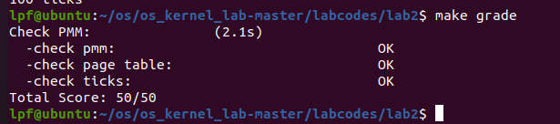
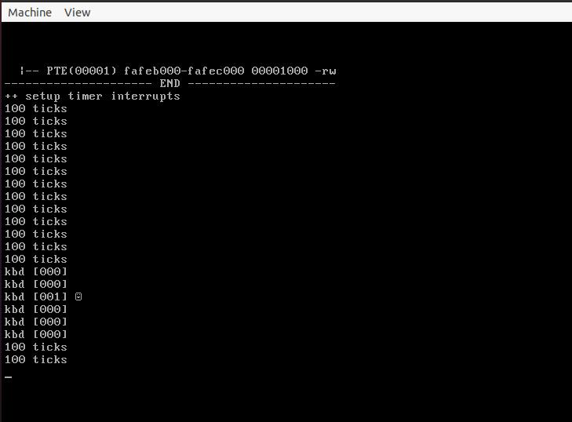

## 实验二
### 练习0：填写已有实验

首先了解本次实验目的在于了解操作系统对于物理内存的管理，我们要做的是手动实现一个简单的物理内存管理系统。     
<<<<<<< HEAD
在lab1中我们了解到计算机上电开始会执行特定地址的一条jump指令，然后跳转到BIOS执行相应的代码，执行完成后转到物理内存执行它加载的第一个块，也就是bootloader，由bootloader相应的启动操作系统内核。但是在本次实验中BIOS的功能进一步细节化，操作系统如果需要知道整个计算机系统的内存是如何分布，就需要BIOS在最开始的时候通过在实模式下进行中断调用（这个中断调用有三个参数，但都是在实模式下进行的（本实验采用的参数是e820h）除了中断调用还有直接探测（直接探测在保护模式下进行））来进行系统物理内存的探测。探测方法是通过中断返回值di不断递增，找到一个一个内存布局（entry）然后存放在一个结构体中。后续操作系统对内存的操作就基于这个e820map的结构体。   
=======
在lab1中我们了解到计算机上电开始会执行特定地址的一条jump指令，然后跳转到BIOS执行相应的代码，执行完成后转到物理内存执行它加载的第一个块，也就是bootloader，由bootloader相应的启动操作系统内核。但是在本次实验中BIOS的功能进一步细节化，操作系统如果需要知道整个计算机系统的内存是如何分布，就需要BIOS在最开始的时候通过在实模式下进行中断调用（这个中断调用有三个参数，但都是在实模式下进行的（本实验采用的参数是e820h）除了中断调用还有直接探测（直接探测在保护模式下进行））来进行系统物理内存的探测。探测方法是通过中断返回值di不断递增，找到一个一个内存布局（entry）然后存放在一个结构体中。后续操作系统对内存的操作就基于这个e820map的结构体。     
>>>>>>> 95afd511e6e9f0d1ef020605017c0550d34b2bee
练习0要求把实验1的部分代码需要整合到本次实验中，经过比较需要更改的文件是kdebug.c和trap.c，其余地方不用更改。
### 练习1：实现 first-fit 连续物理内存分配算法（需要编程）
为了方便管理所有连续的空闲内存空间块我们定义了一个数据结构：
```c
typedef struct {
    list_entry_t free_list;         // the list header
    unsigned int nr_free;           // # of free pages in this free list
} free_area_t;
```
其中包括list_entry的双向链表指针（指向空闲的物理页）和记录当前空闲页个数的无符号整型变量nr_free。

同时我们还需要一个管理物理页的数据结构Page
```c
struct Page {
    int ref;                        // page frame's reference counter
    uint32_t flags;                 // array of flags that describe the status of the page frame
    unsigned int property;          // the num of free block, used in first fit pm manager
    list_entry_t page_link;         // free list link
};
```
ref：表示映射到此物理页的虚拟页的个数，页表里面存放的是页表项也就是虚拟页和物理页之间的对应关系，由于内存小于一个程序的虚拟地址空间或者多个程序的调度引用到同一块内存，那么这块内存被引用的次数（有多少个页表项引用到该物理页）就需要被记住。

flags：表示此物理页的状态，为1表示此物理页空闲可被分配不可被释放，为0表示此物理页被占用不可被分配但可以被释放。

property：用来记录连续空闲物理页的数量（Page是连续物理内存块的起始地址也是第一个页的起始地址）。

page_link：通过使用page_link这个双向链表的指针来将一个空闲内存块和比它地址小的内存空闲块和比他地址大的内存空闲块进行连接。

ucore中采用面向对象编程的思想，把物理内存管理的内容抽象成了若干个函数，然后用结构体pmm_manager来将这些函数的指针封装起来。在使用物理内存管理提供的服务的时候就是通过调用初始化完成的pmm_manager中的函数指针即可。具体内容如下：
```c
//pmm.h中
struct pmm_manager {
    const char *name;                                 // XXX_pmm_manager's name
    void (*init)(void);                               // initialize internal description&management data structure
                                                      // (free block list, number of free block) of XXX_pmm_manager 
    void (*init_memmap)(struct Page *base, size_t n); // setup description&management data structcure according to
                                                      // the initial free physical memory space 
    struct Page *(*alloc_pages)(size_t n);            // allocate >=n pages, depend on the allocation algorithm 
    void (*free_pages)(struct Page *base, size_t n);  // free >=n pages with "base" addr of Page descriptor structures(memlayout.h)
    size_t (*nr_free_pages)(void);                    // return the number of free pages 
    void (*check)(void);                              // check the correctness of XXX_pmm_manager 
};
```
我们实现的函数通过在default_pmm.c中有定义：
```c
const struct pmm_manager default_pmm_manager = {
    .name = "default_pmm_manager",
    .init = default_init,
    .init_memmap = default_init_memmap,
    .alloc_pages = default_alloc_pages,
    .free_pages = default_free_pages,
    .nr_free_pages = default_nr_free_pages,
    .check = default_check,
};
```
接下来就是对其中一些函数的修改。

default_init:首先做的是对空闲块链表的初始化list_init（使用默认的函数实现）然后将总空闲块数目置0
```c
//default_init
static void
default_init(void) {
    list_init(&free_list);
    nr_free = 0;
}
```
default_init_memmap：接着是对一整块未被占用的物理内存空间中的每一页的page结构进行初始化。其中有一个函数SetProperty表示将当前参数页设置为空闲块头页可以被分配。
```c
//default_init_memmap
static void
default_init_memmap(struct Page *base, size_t n) {
    assert(n > 0);
    struct Page *p = base;
    for (; p != base + n; p ++) {//相邻的物理页对应的page结构在内存上也是相邻的所以可以通过加上一个偏置
        assert(PageReserved(p));//遍历所有的空闲物理页
        p->flags = p->property = 0; //标记当前页空闲
        set_page_ref(p, 0);    //清空物理页引用计数
    }
    base->property = n;//对头页初始化
    SetPageProperty(base);//将当前页设置为空闲块头页
    nr_free += n;//更新存储所有空闲页数量的全局变量
    list_add_before(&free_list, &(base->page_link));//将该空闲块插入到空闲链表中
}
```
default_alloc_pages：思路很简单，就是从所有的空闲物理内存块中从低地址到高地址依次寻找，直到找到一个空闲物理内存块不小于需要的物理内存块，那么就将这个内存块进行分裂，一部分留给需要的使用，另一部分分裂之后重新加入到空闲链表中。
```c
//default_alloc_pages
static struct Page *
default_alloc_pages(size_t n) {
    assert(n > 0);
    if (n > nr_free) {//进行合法性检查，如果需要的空闲内存块大于全局空闲内存块，则无法分配
        return NULL;
    }
    struct Page *page = NULL;
    list_entry_t *le = &free_list;
    while ((le = list_next(le)) != &free_list) {
        struct Page *p = le2page(le, page_link);
        if (p->property >= n) {  //从头开始遍历保存空闲物理内存快的链表
            page = p;         //找到一个连续内存块大小不小于当前需要的连续内存块大小
            break;
        }
    }
    if (page != NULL) {
        
        if (page->property > n) {
            struct Page *p = page + n;//获得分裂出来的新的空闲块的第一个页的描述信息
            p->property = page->property - n;//更新新的空闲块大小信息
            SetPageProperty(p);
            list_add(&free_list, &(p->page_link));//将新的空闲块插入空闲块列表中
    }
        list_del(&(page->page_link));//删除空闲链表中原先空闲块
        nr_free -= n;//更新总空闲物理页数量
        ClearPageProperty(page);//将分配出去的内存页标记为非空闲
    }
    return page;
}
```
default_free_pages：首先需要确认每一个物理页都是被占用然后需要被释放，然后在这个空闲块中找到是否可以合并的空闲块，把能够合并的空闲块都合并之后，找到这个大的合并的空闲块的插入位置，最后插入就成功释放了被占用的物理内存。
```c
//default_free_pages
static void
default_free_pages(struct Page *base, size_t n) {
    assert(n > 0);
    struct Page *p = base;
    for (; p != base + n; p ++) {
        assert(!PageReserved(p) && !PageProperty(p));//检查物理页是否真的被占用
        p->flags = 0;//标记为空闲
        set_page_ref(p, 0);//清空引用计数
    }
    base->property = n;//设置空闲块大小
    SetPageProperty(base);//设置为表头
    list_entry_t *le = list_next(&free_list);
    while (le != &free_list) {
        p = le2page(le, page_link);
        le = list_next(le);//不断获取链表中下一块
        if (base + base->property == p) {//如果两个空闲块是相邻的
            base->property += p->property;//进行空闲块合并
            ClearPageProperty(p);
            list_del(&(p->page_link));//将合并前的其中一个空闲块删除
        }
        else if (p + p->property == base) {
            p->property += base->property;
            ClearPageProperty(base);
            base = p;
            list_del(&(p->page_link));
        }
    }//合并完成
    nr_free += n;//更新空闲物理页总量
    le = list_next(&free_list);
    while (le != &free_list) {
        p = le2page(le, page_link);
        if (base + base->property <= p) {
            assert(base + base->property != p);//我觉得应该是找到一个插入位置
            break;         //（只有不是相邻的空闲块按照地址大小不用合并）
        }
        le = list_next(le);
    }
    list_add_before(le, &(base->page_link));//将空闲块插入到链表中
    // nr_free += n;
    // list_add(&free_list, &(base->page_link));
}
```
回答问题：你的first fit算法是否有进一步的改进空间？

因为first-fit算法采用的是遍历搜索进行内存空闲块的分配和释放，时间复杂度不可避免地是O(N)，但是实际上我们释放内存块的时候搜索是根据地址即可释放，所以我们可以用二叉树这一数据结构来存储地址，同样的对地址排序，保证左子节点小于自身小于右子节点，这样就可以在O(logn)时间复杂度下完成释放。

### 练习2：实现寻找虚拟地址对应的页表项（需要编程）

la是线性地址，前十位是一级页表查询的表项地址（page directory entry），中间十位是二级页表的查询表项地址（page table entry）
```c
mmu.h
// A linear address 'la' has a three-part structure as follows:
//
// +--------10------+-------10-------+---------12----------+
// | Page Directory |   Page Table   | Offset within Page  |
// |      Index     |     Index      |                     |
// +----------------+----------------+---------------------+
//  \--- PDX(la) --/ \--- PTX(la) --/ \---- PGOFF(la) ----/
//  \----------- PPN(la) -----------/
//
// The PDX, PTX, PGOFF, and PPN macros decompose linear addresses as shown.
// To construct a linear address la from PDX(la), PTX(la), and PGOFF(la),
// use PGADDR(PDX(la), PTX(la), PGOFF(la)).

// page directory index
#define PDX(la) ((((uintptr_t)(la)) >> PDXSHIFT) & 0x3FF)

// page table index
#define PTX(la) ((((uintptr_t)(la)) >> PTXSHIFT) & 0x3FF)
```
```c
//pmm.c中的get_pte
    pde_t *pdep = &pgdir[PDX(la)]; //首先使用PDX函数获取一级页表的位置
    if (!(*pdep & PTE_P)) {//如果获取不成功就尝试是否创建一个二级页表
        struct Page *page;
        if (!create || (page = alloc_page()) == NULL) {//创建二级页表通过create标记位来设置如果为0就不创建
            return NULL;
        }
        set_page_ref(page, 1); //如果能够创建二级页表首先需要将页表引用次数加一
        uintptr_t pa = page2pa(page);//得到page管理的该页物理地址
        memset(KADDR(pa), 0, PGSIZE);//KADDR返回pa对应虚拟地址（线性地址），然后因为没有映射到物理地址所以全部设置为0
        *pdep = pa | PTE_U | PTE_W | PTE_P;//设置控制位分别代表用户态的软件可以读取对应地址的物理内存页内容、物理内存页内容可写、物理内存页存在
    }
    return &((pte_t *)KADDR(PDE_ADDR(*pdep)))[PTX(la)];//最后返回对应地址
 ```
实验文档注释中讲解到         
KADDR：（takes a physical address and returns the corresponding kernel virtual address）接受一个物理地址返回一个虚拟地址。        
在get_pte中最后一条返回语句，意思是说我们如果找到了二级页表或者创建好一个新的二级页表，那么我们就通过KADDR返回我们需要的二级页表对应的虚拟地址（指针数组访问等都是需要在虚拟地址下才能正确的工作，但页表中存放的是真实的物理地址，所以需要KADDR进行转换），然后与上这个二级页表的页表项偏移位置也就是（PTX（la））就是我们最终返回的地址。
#### 请描述页目录项（Pag Director Entry）和页表（Page Table Entry）中每个组成部分的含义和以及对ucore而言的潜在用处。
页目录项：   

|名称|地址|ucore对应|
|:-----:|:-----:|:------:|
|Page Table 4KB Aligned Address|	31 downto 12|	对应的页表地址|
|Avail	|11 downto 9	|PTE_AVAIL|
|Ignored|	8	|
|Page Size	|7	|PTE_PS|
|0|6	|PTE_MBZ|
|Accessed	|5|	PTE_A|
|Cache Disabled|4|PTE_PCD|
|Write Through	|3	|PTE_PWT|
|User/Supervisor|	2|	PTE_U|
|Read/Write	|1	|PTE_W|
|Present	|0	|PTE_P|


页表项：

|名称|地址|ucore对应|
|:-----:|:-----:|:------:|
|Physical Page Address|31 downto 12|	对应物理地址高20位|
|Avail	|11 downto 9	|PTE_AVAIL|
|Global|	8	|
|0	|7	|PTE_MBZ|
|Dirty|6	|PTE_D|
|Accessed	|5|	PTE_A|
|Cache Disabled|4|PTE_PCD|
|Write Through	|3	|PTE_PWT|
|User/Supervisor|	2|	PTE_U|
|Read/Write	|1	|PTE_W|
|Present	|0	|PTE_P|

#### 如果ucore执行过程中访问内存，出现了页访问异常，请问硬件要做哪些事情？

 当ucore执行过程中出现了页访问异常，硬件需要完成的事情分别如下：
 
 - 将发生错误的线性地址保存在cr2寄存器中;
 
 - 在中断栈中依次压入EFLAGS，CS, EIP，以及页访问异常码error code，如果page fault是发生在用户态，则还需要先压入ss和esp，并且切换到内核栈；
 
 - 根据中断描述符表查询到对应page fault的ISR，跳转到对应的ISR处执行，接下来将由软件进行page fault处理；

### 练习3：释放某虚地址所在的页并取消对应二级页表项的映射（需要编程）
当释放一个包含某虚地址的物理内存页时，需要让对应此物理内存页的管理数据结构Page做相关的清除处理，使得此物理内存页成为空闲；另外还需把表示虚地址与物理地址对应关系的二级页表项清除。请仔细查看和理解page_remove_pte函数中的注释。为此，需要补全在 kern/mm/pmm.c中的page_remove_pte函数。     
设计思路:    
首先传入参数是一个一级页目录地址和二级页表项地址还有一个线性地址，然后if判断页是否存在，如果页存在通过pte2page获取物理地址。然后通过page_ref_dec函数查看当前页被引用次数，如果仅被二级页表引用一次，ref引用次数减一就是0，所以一级页表和二级页表都会被释放，如果不为0，说明被多个页表引用，当前页就不能被释放。但是二级页表一定要被释放。
```c
//pmm.h
static inline int
page_ref_dec(struct Page *page) {
    page->ref -= 1;
    return page->ref;
}
```
释放掉二级页表后需要更新TLB防止TLB的缓存中错误的映射关系所以调用tlb_invalidate函数
```c
//pmm.c
void
tlb_invalidate(pde_t *pgdir, uintptr_t la) {
    if (rcr3() == PADDR(pgdir)) {
        invlpg((void *)la);
    }
}
```
最终修改page_remove_pte函数为：      
```c
//page_remove_pte
if (*ptep & PTE_P) {
    struct Page *page = pte2page(*ptep);//获取该页表项对应的物理页的page结构
    if (page_ref_dec(page) == 0) {
        free_page(page);     //free a page
    }
    *ptep = 0;//将二级页表置0表示取消映射
    tlb_invalidate(pgdir, la);//刷新tlb，保证tlb中的缓存不会有错误映射关系
}
```
#### 数据结构Page的全局变量（其实是一个数组）的每一项与页表中的页目录项和页表项有无对应关系？如果有，其对应关系是啥？
存在对应关系，我们通过页目录项高十位地址找到相应的页表，然后在页表中根据中间十位找到相应的页表项，最后查看页表项内容找到物理地址，加上偏移量最终得到物理地址，使用物理地址来获取对应的就是Page数组中的对应项。（查阅资料和实验手册物理地址与page数组项的对应关系是：物理地址除以页大小，然后乘上page结构体的大小获取偏移量然后加上page数组的基地址，最终得到page项的地址）

#### 如果希望虚拟地址与物理地址相等，则需要如何修改lab2，完成此事？ 鼓励通过编程来具体完成这个问题
虚拟地址和物理地址之间的映射存在一个一定的偏移量，本实验中偏移量是0xc0000000，查看mmlayout.h文件中的KERNBASE可知
```c
//mmlayout.h
#define KERNBASE            0xC0000000
#define KMEMSIZE            0x38000000                  // the maximum amount of physical memory
#define KERNTOP             (KERNBASE + KMEMSIZE)
```
更改偏移量为0即可满足题目要求。

最终实验结果：   



## 扩展练习：Challenge：buddy system（伙伴系统）分配算法（需要编程）
