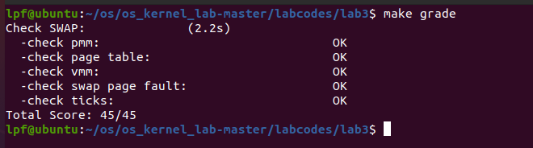
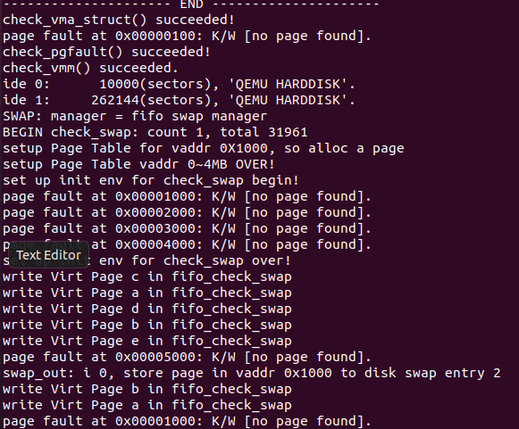
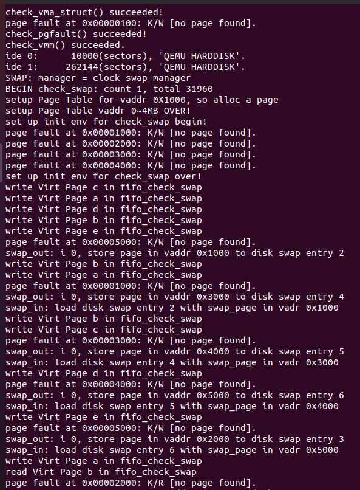

# 实验3
## 练习0：填写已有实验
本实验依赖实验1/2。请把你做的实验1/2的代码填入本实验中代码中有“LAB1”,“LAB2”的注释相应部分。
更改文件有pmm.c(本实验还要对pmm.c进行进一步的更改),default_pmm.c,trap.c,kdebug.c

## 练习1：给未被映射的地址映射上物理页（需要编程）

首先我们在实验二中已经知道，当时处理的数据结构和相关函数的操作都是基于物理内存，但是当用户访问一个地址，操作系统给用户的是一个虚拟地址，操作系统本身会对这个虚拟地址进行一个转换，于是操作系统还需要定义合法的虚拟地址，为此需要两个数据结构：mm_struct和vma_struct数据结构
```c
struct vma_struct {
    // the set of vma using the same PDT
    struct mm_struct *vm_mm;
    uintptr_t vm_start; // start addr of vma
    uintptr_t vm_end; // end addr of vma
    uint32_t vm_flags; // flags of vma
    //linear list link which sorted by start addr of vma
    list_entry_t list_link;
};
```

vma存放的就是虚拟地址的合法地址范围（start指向起始地址，end指向结束地址）和一些属性（vm_flags读写以及特权）以及链接其他vma和指向更高抽象层mm_struct的指针（vm_mm）。
```c
//vm_flags对应的属性
#define VM_READ 0x00000001 //只读
#define VM_WRITE 0x00000002 //可读写
#define VM_EXEC 0x00000004 //可执行
```

mm_strcut是vma更高层的虚拟内存抽象层，合法虚拟内存vma之间的链接是依赖于双向链表的数据结构链接，mmap_list是双向链表头，pgdir用来查找虚拟地址对应的二级页表项是否存在以及页表项相关属性，map_count记录链接的vma的个数，sm_priv指向用来链接记录页访问情况的链表头。mmap_cache指向当前正在使用的虚拟内存空间（由于局部性原理，这个类似于缓存的指针用来提高查找虚拟内存的效率）。
```c
struct mm_struct {
    // linear list link which sorted by start addr of vma
    list_entry_t mmap_list;
    // current accessed vma, used for speed purpose
    struct vma_struct *mmap_cache;
    pde_t *pgdir; // the PDT of these vma
    int map_count; // the count of these vma
    void *sm_priv; // the private data for swap manager
};
```


当产生页访问异常，cpu会把产生错误的页访问地址存储在cr2寄存器，同时也会把表示页访问异常的错误类型的error_code码存放在中断栈中，并且还压入了许多寄存器（trapentry.S中的标号__alltraps处压入了ds,es,fs,gs寄存器）到中断栈中。

```bash
#压入中断栈的寄存器
.globl __alltraps
__alltraps:
    # push registers to build a trap frame
    # therefore make the stack look like a struct trapframe
    pushl %ds
    pushl %es
    pushl %fs
    pushl %gs
```

此外还有EFLAGS，CS，EIP。因为页访问异常的中断号是0xE，所以对应的把中断服务例程的地址加载到了CS和EIP然后开始执行中断服务例程，然后在trap.c文件中开始层层调用

```bash
#调用关系
trap--> trap_dispatch-->pgfault_handler-->do_pgfault
```

最后调用完成页处理异常的主要函数do_pgfault

```c
do_pgfault(struct mm_struct *mm, uint32_t error_code, uintptr_t addr) 
```

传入的三个参数第一个参数mm是专门管理虚拟内存的，error_code存放也访问异常错误类型，addr是一个线性地址（本实验中是线性地址我觉得其实是虚拟地址）

```c
 int ret = -E_INVAL;
    //try to find a vma which include addr
    struct vma_struct *vma = find_vma(mm, addr);

    pgfault_num++;
    //If the addr is in the range of a mm's vma?
    if (vma == NULL || vma->vm_start > addr) {
        cprintf("not valid addr %x, and  can not find it in vma\n", addr);
        goto failed;
    }
```

do_pgfault第一件事是根据传进来的addr去虚拟内存查找该地址是否属于合法地址，也就是是否在某一个vma指定的start和end范围之内。具体我们查看vmm.c中的find_vma函数

```c
struct vma_struct *
find_vma(struct mm_struct *mm, uintptr_t addr) {
    struct vma_struct *vma = NULL;
    if (mm != NULL) {
        vma = mm->mmap_cache;       //类似于一个缓存，mmap_cache总是指向当前访问的虚拟内存（在这里表示想看看上次刚访问的虚拟内存我现在是不是我刚好需要的）
        if (!(vma != NULL && vma->vm_start <= addr && vma->vm_end > addr)) {  //如果我想查找的虚拟地址不在这个cache的vma合法范围中或者我通过cache获得的vma是空的，我要进行全部查找
                bool found = 0;                       //found标记是否找到一个合适的vma
                list_entry_t *list = &(mm->mmap_list), *le = list;      //还记得我们mm_struct中mmap_list的定义，是vma双向链表的链表头
                while ((le = list_next(le)) != list) {          //开始进行从头到尾的搜索
                    vma = le2vma(le, list_link);
                    if (vma->vm_start<=addr && addr < vma->vm_end) {     //判断这个vma的范围是不是能够包住我们的虚拟地址addr
                        found = 1;
                        break;
                    }
                }
                if (!found) {
                    vma = NULL;
                }
        }
        if (vma != NULL) {
            mm->mmap_cache = vma;
        }
    }
    return vma;          //如果找到就返回这个vma
}
```

详细注释在代码中展示，具体思路就是去找一个能够使我们的虚拟地址合法的vma，首先从cache中找，找不到就用存放在mm中的mmap_list这个链接所有vma的双向链表头指针从头到尾的找。找到就返回vma找不到就返回NULL。

```c
    if (vma == NULL || vma->vm_start > addr) {
        cprintf("not valid addr %x, and  can not find it in vma\n", addr);
        goto failed;
    }
```
这个do_pgfault函数中判断你是否找到这个vma，找不到就goto到failed，failed中的内容就是return ret（应该是返回失败了，ret就是-E_INVAL）

当我们找到这个vma之后，我们根据error_code判断这个页访问异常的类型（error_code帮助我们知道页访问异常是三种类型的哪一种，而使用vma是为了利用它里面的flag所包括的（虚拟内存）读写执行三种属性，从而具体到是error_code第二种页访问异常中的读异常还是写异常或者是特权异常）

```c
    switch (error_code & 3) { //error_code三个位中的定义，第一位代表对应物理页是否存在，第二位表示是否读写异常，第三位表示
    default:
            /* error code flag : default is 3 ( W/R=1, P=1): write, present */
    case 2: /* error code flag : (W/R=1, P=0): write, not present */
        if (!(vma->vm_flags & VM_WRITE)) {
            cprintf("do_pgfault failed: error code flag = write AND not present, but the addr's vma cannot write\n");
            goto failed;
        }
        break;
```
这里表示如果你要进行一个写操作也就是VM_WRITE那需要和vma的属性进行比较一下，看vma是否能够进行写操作，也就是vm_flags和VM_WRTIE进行与运算如果为0说明不能进行vma的属性是不能进行写操作的，所以要出错。
```c
    case 1: /* error code flag : (W/R=0, P=1): read, present */
        cprintf("do_pgfault failed: error code flag = read AND present\n");
        goto failed;
```
error_code码第二位为0，第一位为1表示读取在物理内存中存在的物理页，这里报错是页访问权限不符合的问题
```c
    case 0: /* error code flag : (W/R=0, P=0): read, not present */
        if (!(vma->vm_flags & (VM_READ | VM_EXEC))) {
            cprintf("do_pgfault failed: error code flag = read AND not present, but the addr's vma cannot read or exec\n");
            goto failed;
        }
```
读取不存在的物理页，并且这个物理页不允许被读或者执行。

除去这三种情况，剩下的就是操作系统需要解决的情况包括，写一个存在的物理页，写一个不存在的物理页但是这个地址是允许写操作，以及读取一个不存在的物理页，但是这个地址是可读的。

```c
    if ((ptep = get_pte(mm->pgdir, addr, 1)) == NULL) {
        cprintf("get_pte in do_pgfault failed\n");
        goto failed;
    }
```
首先从mm管理的pgdir这个指针去寻找addr这个线性地址在页目录中一级页表项是否对应存在，如果不存在第三个参数就是create标记位，表示如果不存在二级页表（也就是一级页表项）那么就自己创建一个，然后再去返回二级页表项里面的那个虚拟地址，如果返回为NULL说明返回失败了，就报错。

```c
    if (*ptep == 0) { // if the phy addr isn't exist, then alloc a page & map the phy addr with logical addr
        if (pgdir_alloc_page(mm->pgdir, addr, perm) == NULL) {
            cprintf("pgdir_alloc_page in do_pgfault failed\n");
            goto failed;
        }
    }
```
如果此时二级页表项的内容是空的，那么就要给这个二级页表项的内容分配对应的物理页，建立一个虚拟地址到物理地址的映射关系，如果建立失败就返回NULL说明空闲内存不足以分配一个页给这个虚拟地址，就得报错。

## 练习2：补充完成基于FIFO的页面替换算法
如果此时二级页表项的内容是非空的，说明此时虚拟地址对应的内容存放在磁盘中

```c
    else { // if this pte is a swap entry, then load data from disk to a page with phy addr
           // and call page_insert to map the phy addr with logical addr
        if(swap_init_ok) {
            struct Page *page=NULL;   //尝试将硬盘中的内容换入到page中
            if ((ret = swap_in(mm, addr, &page)) != 0) {
                cprintf("swap_in in do_pgfault failed\n");
                goto failed;
            }    
            page_insert(mm->pgdir, page, addr, perm);     //建立线性地址和物理地址之间的映射
            swap_map_swappable(mm, addr, page, 1);  //更新页访问相关情况
            page->pra_vaddr = addr;
        }
        else {
            cprintf("no swap_init_ok but ptep is %x, failed\n",*ptep);
            goto failed;
        }
   }
```
这时我们需要swap_in函数来将这一页内容读入到对应的物理页中，同时利用page_insert函数来建立该线性地址和物理地址之间的映射关系，并且更新页访问情况（因为你新换入了一页，跟页访问情况有关的链表需要更新）

查看swap_in函数
```c
//swap.c
int
swap_in(struct mm_struct *mm, uintptr_t addr, struct Page **ptr_result)
{
     struct Page *result = alloc_page();
     assert(result!=NULL);

     pte_t *ptep = get_pte(mm->pgdir, addr, 0);//pgdir就是一级页表的位置,该函数返回二级页表项，实际物理页的虚拟地址
     // cprintf("SWAP: load ptep %x swap entry %d to vaddr 0x%08x, page %x, No %d\n", ptep, (*ptep)>>8, addr, result, (result-pages));
    
     int r;
     if ((r = swapfs_read((*ptep), result)) != 0)
     {
        assert(r!=0);
     }
     cprintf("swap_in: load disk swap entry %d with swap_page in vadr 0x%x\n", (*ptep)>>8, addr);
     *ptr_result=result;
     return 0;
}
```
这个函数利用alloc_page()获取相应的物理页，然后利用get_pte获取addr通过pgdir得到对应的虚拟地址，然后将扇区内容通过swapfs_read函数读取到物理页result中，真正保存物理页信息的是ptr_result这个指针所以最后还有一个赋值。

#### 中断产生(这里是我的一个小疑问)
查阅资料说alloc_page(也就是在swap_in中)如果得不到一个空闲的物理页就会选择替换的方式去把某一物理页替换掉然后把这一个换出来的物理页留给我们后续处理。但是当我搜查代码，alloc_page是一个宏定义对应的是pmm.h中alloc_pages(1)，而相应的alloc_pages(1)的实现是通过pmm_manager类里面的一个方法，这个方法在default_pmm.c中有实现，代码如下：
```c
//pmm.h
#define alloc_page() alloc_pages(1)
```
```c
//pmm.c
struct Page *
alloc_pages(size_t n) {
    struct Page *page=NULL;
    bool intr_flag;
    local_intr_save(intr_flag);
    {
        page = pmm_manager->alloc_pages(n);
    }
    local_intr_restore(intr_flag);
    return page;
}
```
```c
//deault.pmm.c
static struct Page *
default_alloc_pages(size_t n) {
    assert(n > 0);
    if (n > nr_free) {
        return NULL;
    }
    struct Page *page = NULL;
    list_entry_t *le = &free_list;
    // TODO: optimize (next-fit)
    while ((le = list_next(le)) != &free_list) {
        struct Page *p = le2page(le, page_link);
        if (p->property >= n) {
            page = p;
            break;
        }
    }
    if (page != NULL) {
        if (page->property > n) {
            struct Page *p = page + n;
            p->property = page->property - n;
            SetPageProperty(p);
            list_add_after(&(page->page_link), &(p->page_link));
        }
        list_del(&(page->page_link));
        nr_free -= n;
        ClearPageProperty(page);
    }
    return page;
}
```
并未发现对物理页进行换出的操作，所以在根本上也就没有实现将某一物理页换出的操作，所以需要对alloc_pages进行更改。alloc_pages更改如下：
```c
//pmm.c
alloc_pages(size_t n) {
    struct Page *page=NULL;
    bool intr_flag;
    
    while (1)
    {
         local_intr_save(intr_flag);
         {
              page = pmm_manager->alloc_pages(n);
         }
         local_intr_restore(intr_flag);

         if (page != NULL || n > 1 || swap_init_ok == 0) break;
         
         extern struct mm_struct *check_mm_struct;
         //cprintf("page %x, call swap_out in alloc_pages %d\n",page, n);
         swap_out(check_mm_struct, n, 0);
    }
    //cprintf("n %d,get page %x, No %d in alloc_pages\n",n,page,(page-pages));
    return page;
}
```
这个更改的代码说明，如果物理内存中存在着空闲的物理页，那么就会分配给page，page不为空，或者分配的物理页大于1（根据上面我们看到，alloc_page就是alloc_pages(1),这就是为什么判断条件里面有一个1的原因）那么我们就可以跳出循环因为分配成功了，但是如果分配不成功，也就是说当前物理内存已经满了，没有空闲的物理页吗，那么我就要用swap_out函数换出一个物理页。
#### 紧接上文中断地方
我们在alloc_page中如果没有找到相应的空闲物理页，我们调用swap_out需要使用相应的页替换策略来找一个物理页替换（FIFO策略）
查看swap_out代码
```c
//swap.c
int
swap_out(struct mm_struct *mm, int n, int in_tick)
{
     int i;
     for (i = 0; i != n; ++ i)
     {
          uintptr_t v;
          //struct Page **ptr_page=NULL;
          struct Page *page;
          // cprintf("i %d, SWAP: call swap_out_victim\n",i);
          int r = sm->swap_out_victim(mm, &page, in_tick);
          if (r != 0) {
                    cprintf("i %d, swap_out: call swap_out_victim failed\n",i);
                  break;
          }          
          //assert(!PageReserved(page));

          //cprintf("SWAP: choose victim page 0x%08x\n", page);
          
          v=page->pra_vaddr; 
          pte_t *ptep = get_pte(mm->pgdir, v, 0);
          assert((*ptep & PTE_P) != 0);

          if (swapfs_write( (page->pra_vaddr/PGSIZE+1)<<8, page) != 0) {
                    cprintf("SWAP: failed to save\n");
                    sm->map_swappable(mm, v, page, 0);
                    continue;
          }
          else {
                    cprintf("swap_out: i %d, store page in vaddr 0x%x to disk swap entry %d\n", i, v, page->pra_vaddr/PGSIZE+1);
                    *ptep = (page->pra_vaddr/PGSIZE+1)<<8;
                    free_page(page);
          }
          
          tlb_invalidate(mm->pgdir, v);
     }
     return i;
}
```
如果我们需要n个物理页，那么用一个for循环来执行，通过swap_out_victim挑选相应的页替换，相应替换的页我们会放在page里面，如果找到成功，swap_out_victim返回值就会是0，用v存储物理页对应的虚拟起始地址，然后利用get_pte获得对应的二级页表项这个pte，然后调用swapfs_write函数将物理页的内容写入到扇区中，swap_out_victim代码如下:
```c
_fifo_swap_out_victim(struct mm_struct *mm, struct Page ** ptr_page, int in_tick)
{
     list_entry_t *head=(list_entry_t*) mm->sm_priv;
         assert(head != NULL);
     assert(in_tick==0);
     /* Select the victim */
     /*LAB3 EXERCISE 2: YOUR CODE*/ 
     //(1)  unlink the  earliest arrival page in front of pra_list_head qeueue
     //(2)  assign the value of *ptr_page to the addr of this page
     /* Select the tail */
     list_entry_t *le = head->prev;
     assert(head!=le);
     struct Page *p = le2page(le, pra_page_link);
     list_del(le);
     assert(p !=NULL);
     *ptr_page = p;
     return 0;
}
```
我们首先获取sm_priv这个结构体元素页访问情况链表头，然后需要断言这个双向链表不是空的，接着得到一个页（也就是le对应的页），删除le（因为最近访问的页都添加在链表的最后面，所以le是最近没有被访问的页），同时我们把找到的页通过指针的方式存储在ptr_page中，这样在swap_out中我们就知道被挑出来的是哪一页。

继续回到swap_out如果写入磁盘不成功，那么必须要把原来的映射关系恢复（利用map_swappable），如果写入成功，写入扇区的起始地址就是(page->pra_vaddr/PGSIZE+1)<<8，那么就需要释放物理内存里的页。这也就可以解释map_swappable里面的代码：
```c
static int
_fifo_map_swappable(struct mm_struct *mm, uintptr_t addr, struct Page *page, int swap_in)
{
    list_entry_t *head=(list_entry_t*) mm->sm_priv;
    list_entry_t *entry=&(page->pra_page_link);
 
    assert(entry != NULL && head != NULL);
    //record the page access situlation
    /*LAB3 EXERCISE 2: YOUR CODE*/ 
    //(1)link the most recent arrival page at the back of the pra_list_head qeueue.
    list_add(head, entry);
    return 0;
}
```
因为我们删除的是紧紧跟在头指针后面的元素，但是如果写入磁盘不成功，那么我们需要把原来的页访问情况还原回去，所以list_add(head,entry)，head后面加入这个entry。

最终结果：



实验结果分析：
首先初始化各物理页内容,a,b,c,d，此时访问c,a,d,b均命中，然后访问e页访问异常，这个时候需要选择页进行替换，选择a(因为先进先出)，此时页访问情况双向循环链表就是b,c,d,e然后访问b命中，访问a，页访问异常，于是更新双向链表变成c,d,e,a，再接下来访问b，同样的道理没有命中，于是更新链表d,e,a,b，后面的访问与更新也是同样的道理。
## 扩展练习：实现识别dirty bit的 extended clock页替换算法（需要编程）

扩展练习实现：
将swap_clock.h和swap_clock.c文件加入到相应目录下，然后更改swap.c中init函数的swap_manager转换成swap_manager_clock即可。
```c
swap_init(void)
{
     swapfs_init();

     if (!(1024 <= max_swap_offset && max_swap_offset < MAX_SWAP_OFFSET_LIMIT))
     {
          panic("bad max_swap_offset %08x.\n", max_swap_offset);
     }
     

     sm = &swap_manager_clock;
     int r = sm->init();
     
     if (r == 0)
     {
          swap_init_ok = 1;
          cprintf("SWAP: manager = %s\n", sm->name);
          check_swap();
     }

     return r;
}
```

实现算法代码如下：
```c
static int
_clock_swap_out_victim(struct mm_struct *mm, struct Page ** ptr_page, int in_tick)
{
     list_entry_t *head=(list_entry_t*) mm->sm_priv;
     assert(head != NULL);
     assert(in_tick==0);

     list_entry_t *selected = NULL, *p = head;
     // Search <0,0>
     do {
        if (GET_ACCESSED_FLAG(mm->pgdir, p) == 0 && GET_DIRTY_FLAG(mm->pgdir, p) == 0) {
            selected = p;
            break;
        }
        p = list_next(p);
     } while (p != head);
     // Search <0,1> and set 'accessed' to 0
     if (selected == NULL)
        do {
            if (GET_ACCESSED_FLAG(mm->pgdir, p) == 0 && GET_DIRTY_FLAG(mm->pgdir, p)) {
                selected = p;
                break;
            }
            CLEAR_ACCESSED_FLAG(mm->pgdir, p);
            p = list_next(p);
        } while (p != head);
     // Search <0,0> again
     if (selected == NULL)
        do {
            if (GET_ACCESSED_FLAG(mm->pgdir, p) == 0 && GET_DIRTY_FLAG(mm->pgdir, p) == 0) {
                selected = p;
                break;
            }
            p = list_next(p);
        } while (p != head);
     // Search <0,1> again
     if (selected == NULL)
        do {
            if (GET_ACCESSED_FLAG(mm->pgdir, p) == 0 && GET_DIRTY_FLAG(mm->pgdir, p)) {
                selected = p;
                break;
            }
            p = list_next(p);
        } while (p != head);
     // Remove pointed element
     head = selected;
     if (list_empty(head)) {
        mm->sm_priv = NULL;
     } else {
         mm->sm_priv = list_next(head);
        list_del(head);
     }
     *ptr_page = le2page(head, pra_page_link);
     return 0;
}
```

代码理解：
一共设置两个位分别是修改位和访问位，如果修改位和访问位同时为0，那么这一页就是我们要替换的，利用selected标志位标志我们是否找到一个可替换的页，如果没找到，那么我们就去寻找修改位为1的（表示最近被修改）访问位为0的物理页（表示最近没有被访问），然后替换这一页，如果当前页不符合条件，就清楚访问位为0，然后去寻找下一个物理页pte。如果还没找到，再次搜索两个位都为0的或者一个位为0一个位为1的pte（这个时候一定会搜索到，因为之前访问位为1的物理页在第二个循环中已经被换成0了），找到之后移除这个页，将指针指向下一个。

查看实验结果：



分析实验结果：
首先同样的分配四个物理页内容分别是abcd，然后由于访问过c,a,d,b我将所有四个访问位和修改位全部置1，接着访问e，发现没有于是就开始遍历查找访问位为0的页，会发现四个物理页访问位和修改位都是1，这个时候如果访问位和修改位是1就需要变成0，于是abcd访问一圈后访问位和修改位全部变成0，第二次循环时看到a页为0于是替换为e，访问位和修改位置1。此时四个物理页内容是ebcd，其中e的访问位和修改位是1，然后访问（write）b，b物理页的pte的访问位和修改位也变成1，此时内容是ebcd，eb访问位和修改位内容是1，接着访问a，当前指针指向b，b访问位和修改位是1，找到c替换，所以物理页内容是ebad此时ae访问位和修改位是1，接着访问b，b存在，b的访问位和修改位又被置1，此时物理页内容是ebad，abe访问位和修改位都是1，指针指向b，接下来访问c，ba访问位和修改位全部清0，然后找到d进行替换，此时内容是ebac，ec访问位和修改位都是1，指针指向e之后依此类推可以得到答案，这个检查函数加入read表示读取内容也就是说，不会进行修改位的变化。
## 思考题

#### 1.1请描述页目录项（Pag Director Entry）和页表（Page Table Entry）中组成部分对ucore实现页替换算法的潜在用处。
表项中PTE_A表示内存页是否被访问过，PTE_D表示内存页是否被修改过，借助着两位标志位可以实现Enhanced Clock算法。
#### 1.2如果ucore的缺页服务例程在执行过程中访问内存，出现了页访问异常，请问硬件要做哪些事情？
页访问异常 会将产生页访问异常的线性地址存入 cr2 寄存器中 并且给出 错误码 error_code 说明是页访问异常的具体原因 uCore OS 会将其 存入 struct trapframe 中 tf_err 等到中断服务例程 调用页访问异常处理函数(do_pgfault()) 时 再判断 具体原因 若不在某个VMA的地址范围内 或 不满足正确的读写权限 则是非法访问 若在此范围 且 权限也正确 则 认为是 合法访问 只是没有建立虚实对应关系 应分配一页 并修改页表 完成 虚拟地址到 物理地址的映射 刷新 TLB 最后再 调用 iret 重新执行引发页访问异常的 那条指令 若是在外存中 则将其换入 内存 刷新 TLB 然后退出中断服务例程 重新执行引发页访问异常的 那条指令
#### 如果要在ucore上实现"extended clock页替换算法"请给你的设计方案，现有的swap_manager框架是否足以支持在ucore中实现此算法？如果是，请给你的设计方案。如果不是，请给出你的新的扩展和基此扩展的设计方案。并需要回答如下问题
##### 2.1 需要被换出的页的特征是什么？
首选 页表项的两个位（访问位，修改位） Dirty Bit 为 0 的页 且 Access Bit 为 0 的页 其次是 访问了但没修改的页 最次是 访问了修改了的页
##### 2.2 在ucore中如何判断具有这样特征的页？
当内存页被访问后，MMU将在对应的页表项的PTE_A这一位设为1；

当内存页被修改后，MMU将在对应的页表项的PTE_D这一位设为1。
##### 2.3 何时进行换入和换出操作？
换入是在缺页异常从磁盘中取页到内存的时候 换出是在物理页帧满的时候把页从内存转到磁盘。

## 总结
本次实验了解到页访问异常操作系统需要进行的一系列行动，包括采用两个数据结构来判断虚拟地址是否合法，然后根据合法的虚拟地址建立虚拟地址和物理地址之间的映射，要么是分配一个空闲的内存物理页，要么是从磁盘上取需要的物理页替换物理内存中的某一页，本次实验采用的替换策略是FIFO策略，扩展练习采用的增强时钟算法其实就是近似LRU算法，本次实验与第二次实验联系十分紧密，我们必须清楚的划分物理内存页和虚拟内存管理，对于操作系统而言，必须制定非常详细的策略来完成两者的转换，包括了合法与不合法，如何转换，转换的时候如果转换不了又应该怎么办。分析最后的实验结果加深了自己对两种替换策略的理解。对于代码理解可能还不太熟练，所以在后来扩展实验的时候，我觉得没有进行访问位和修改位的修改（当执行换入的时候）所以自己添加代码对位的修改，不过好像是多此一举。
