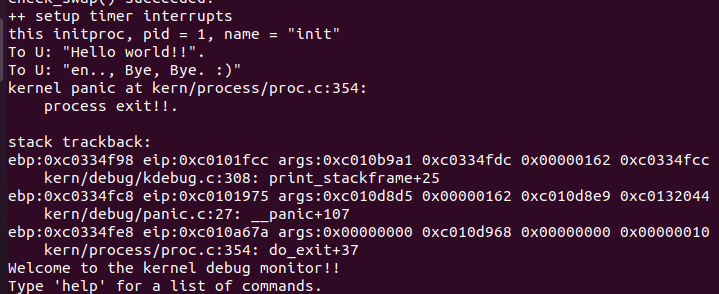
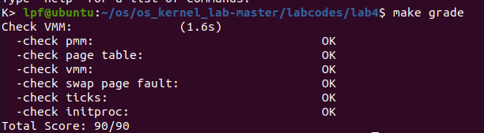

## lab4
### 练习0：填写已有实验

经过检查需要修改的文件如下：default_pmm.c
pmm.c
swap_fifo.c
vmm.c
trap.c

### 练习1：分配并初始化一个进程控制块（需要编码）
首先了解重要的数据结构

```c
//proc.h
struct proc_struct {
    enum proc_state state;                      // Process state
    int pid;                                    // Process ID
    int runs;                                   // the running times of Proces
    uintptr_t kstack;                           // Process kernel stack
    volatile bool need_resched;                 // bool value: need to be rescheduled to release CPU?
    struct proc_struct *parent;                 // the parent process
    struct mm_struct *mm;                       // Process's memory management field
    struct context context;                     // Switch here to run process
    struct trapframe *tf;                       // Trap frame for current interrupt
    uintptr_t cr3;                              // CR3 register: the base addr of Page Directroy Table(PDT)
    uint32_t flags;                             // Process flag
    char name[PROC_NAME_LEN + 1];               // Process name
    list_entry_t list_link;                     // Process link list 
    list_entry_t hash_link;                     // Process hash list
};
```
- state:用于表明进程状态。查找对应proc_state可知线程一共对应四种状态分别是刚创建进程的初始态，挂起，等待（或者运行），死亡（代码中注释的意思就是等待被父进程回收资源的子线程）。
```c
//proc.h
enum proc_state {
    PROC_UNINIT = 0,  // uninitialized
    PROC_SLEEPING,    // sleeping
    PROC_RUNNABLE,    // runnable(maybe running)
    PROC_ZOMBIE,      // almost dead, and wait parent proc to reclaim his resource
};
```
- pid和name：用于区别每一个线程通过给线程分配一个号（pid）还有一个名字，runs用于记录线程运行次数。
- kstack:每个线程都有自己运行的内核栈，我们创建线程的时候都需要为每个线程分配好内核栈。
- need_resched:是否重新被调度，来主动释放cpu。
- parent:创建该线程的父进程的指针。
- mm：用于虚拟内存管理，由于本次实验线程都是运行在内存上，不需要进行硬盘和内存上的物理页交换，所以暂时不需要考虑。
- context：利用context保证能够在内核中进行上下文切换，具体来讲就是cpu如果调度另外一个线程的时候，会通过context进行当前状态（一系列寄存器）的保存，在恢复线程的时候也是通过context给寄存器赋原来的值来恢复。查看context内容：
```c
//proc.h
struct context {
    uint32_t eip;
    uint32_t esp;
    uint32_t ebx;
    uint32_t ecx;
    uint32_t edx;
    uint32_t esi;
    uint32_t edi;
    uint32_t ebp;
};
```
发现context里面是一系列的寄存器。
- tf：当产生中断使得从三个特权级或者说从用户态切换到内核态的时候，我们需要用这个指针保存原来状态的所有信息。
- cr3：保存页表的物理地址

最后两个链表用于管理线程控制块，我们用TCB管理线程，为了管理所有的线程我们通过哈希链表（查找表）以及双向链表把所有的TCB连接起来进行管理。       

操作系统内核在init.c::kern_init函数调用了proc.c::proc_init函数。proc_init函数启动了创建内核线程的步骤。查看proc_init代码:
```c
//proc.c
void
proc_init(void) {
    int i;

    list_init(&proc_list);
    for (i = 0; i < HASH_LIST_SIZE; i ++) {
        list_init(hash_list + i);
    }

    if ((idleproc = alloc_proc()) == NULL) {
        panic("cannot alloc idleproc.\n");
    }

    idleproc->pid = 0;
    idleproc->state = PROC_RUNNABLE;
    idleproc->kstack = (uintptr_t)bootstack;
    idleproc->need_resched = 1;
    set_proc_name(idleproc, "idle");
    nr_process ++;

    current = idleproc;

    int pid = kernel_thread(init_main, "Hello world!!", 0);
    if (pid <= 0) {
        panic("create init_main failed.\n");
    }

    initproc = find_proc(pid);
    set_proc_name(initproc, "init");

    assert(idleproc != NULL && idleproc->pid == 0);
    assert(initproc != NULL && initproc->pid == 1);
}
```
在创建内核线程的过程中，首先创建idleproc这个第0个线程，通过alloc_proc()为该线程分配资源并进行一些初始化。查看alloc_proc代码：
```c
//proc.c
static struct proc_struct *
alloc_proc(void) {
    struct proc_struct *proc = kmalloc(sizeof(struct proc_struct));
    if (proc != NULL) {
        proc->state = PROC_UNINIT;
        proc->pid = -1;
        proc->runs = 0;
        proc->kstack = 0;
        proc->need_resched = 0;
        proc->parent = NULL;
        proc->mm = NULL;
        memset(&(proc->context), 0, sizeof(struct context));
        proc->tf = NULL;
        proc->cr3 = boot_cr3;
        proc->flags = 0;
        memset(proc->name, 0, PROC_NAME_LEN);
    }
    return proc;
}
```
alloc_proc函数通过kmalloc函数获取proc_struct结构的一块内存块。然后如果分配成功，就进行一些初始化，包括：设置状态为创建的初始态，此时pid设置为-1（因为还没有真正创建好一个线程，此时只是说暂时留了一块地方给它创建的线程），由于还没有开始运行所以运行次数是0，内核栈也还没有分配，但刚刚创建的线程的物理页表的基址都是相同的，因为现在的线程都是属于内核这个大进程,所以cr3设置为boot_cr3。

alloc_proc分配成功后，proc_init要对idle_proc这个线程做进一步的初始化，然后通过kernel_thread来创建init_proc这个新线程。练习2就是针对init_proc这个新线程分配资源。

#### 设计过程：
alloc_proc通过kmalloc函数为proc_struct所有成员变量分配内存空间，然后根据注释对所有成员变量进行一个初步的初始化。
### 练习2：为新创建的内核线程分配资源（需要编码）

idle_proc调用kernel_thread函数来创建init_proc线程。查看kernel_thread代码:
```c
//proc.c
int
kernel_thread(int (*fn)(void *), void *arg, uint32_t clone_flags) {
    struct trapframe tf;
    memset(&tf, 0, sizeof(struct trapframe));
    tf.tf_cs = KERNEL_CS;
    tf.tf_ds = tf.tf_es = tf.tf_ss = KERNEL_DS;
    tf.tf_regs.reg_ebx = (uint32_t)fn;
    tf.tf_regs.reg_edx = (uint32_t)arg;
    tf.tf_eip = (uint32_t)kernel_thread_entry;
    return do_fork(clone_flags | CLONE_VM, 0, &tf);
}
```
首先kernel_thread采用了局部变量tf（先给中断帧分配好空间并进行初始化，其中eip指出了init_proc线程从哪里执行也就是从kernel_thread_entry开始执行）来放置保存内核线程的临时中断帧，并把中断帧的指针传递给do_fork函数。然后具体的创建是kernel_thread通过do_fork完成具体内核线程的创建工作。查看do_fork代码:
```c
//proc.c
int
do_fork(uint32_t clone_flags, uintptr_t stack, struct trapframe *tf) {
    int ret = -E_NO_FREE_PROC;
    struct proc_struct *proc;
    if (nr_process >= MAX_PROCESS) {
        goto fork_out;
    }
    ret = -E_NO_MEM;
    //创建一个TCB并初始化所有成员变量
    if ((proc = alloc_proc()) == NULL) {
        goto fork_out;
    }
    proc->parent = current;
    //分配并初始化内核栈
    if (setup_kstack(proc) != 0) {
        goto bad_fork_cleanup_proc;
    }
    //根据clone_flag标志复制或共享进程内存管理结构
    if (copy_mm(clone_flags, proc) != 0) {
        goto bad_fork_cleanup_kstack;
    }
    //设置进程在内核（将来也包括用户态）正常运行和调度所需的中断帧和执行上下文
    copy_thread(proc, stack, tf);
    //把设置好的进程控制块放入hash_list和proc_list两个全局进程链表中
    bool intr_flag;
    local_intr_save(intr_flag);
    {
        proc->pid = get_pid();
        hash_proc(proc);
        list_add(&proc_list, &(proc->list_link));
        nr_process ++;
    }
    local_intr_restore(intr_flag);
    //wakeup_proc:  set proc->state = PROC_RUNNABLE
    //把进程状态设置为“就绪”态
    wakeup_proc(proc);
    //设置返回码为子进程的id号
    ret = proc->pid;
fork_out:
    return ret;

bad_fork_cleanup_kstack:
    put_kstack(proc);
bad_fork_cleanup_proc:
    kfree(proc);
    goto fork_out;
}
```
do_fork的工作如下：
- 通过alloc_proc为TCB成员变量分配空间并作初步的初始化；
- 分配并初始化内核栈（setup_stack函数）；
- 根据clone_flag标志复制或共享进程内存管理结构（copy_mm函数）；
- 设置进程在内核（将来也包括用户态）正常运行和调度所需的中断帧和执行上下文（copy_thread函数）；
- 把设置好的进程控制块放入hash_list和proc_list两个全局进程链表中；
- 自此，进程已经准备好执行了，把进程状态设置为“就绪”态；
- 设置返回码为子进程的id号。
### 练习3：阅读代码，理解 proc_run 函数和它调用的函数如何完成进程切换的。（无编码工作）
首先在内核线程初始化完成之后，第0个线程就会通过cpu_idle一直循环通过schedule这个函数来调度下一个线程，查看schedule函数:
```c
//sched.c
void
schedule(void) {
    bool intr_flag; //定义中断变量
    list_entry_t *le, *last; //当前list，下一list
    struct proc_struct *next = NULL; //下一线程
    //关闭中断
    local_intr_save(intr_flag); 
    {
        current->need_resched = 0; 
      //last是否是idle进程(第一个创建的线程),如果是，则从表头开始搜索  否则获取下一链表
        last = (current == idleproc) ? &proc_list : &(current->list_link);
        le = last; 
        //循环找到可调度的进程
        do 
        { 
            if ((le = list_next(le)) != &proc_list) 
            {
                //获取下一进程
                next = le2proc(le, list_link);
                //找到一个可以调度的进程，break
                if (next->state == PROC_RUNNABLE) 
                    break;
            }
        } while (le != last);
        //如果没有找到可调度的进程
        if (next == NULL || next->state != PROC_RUNNABLE) 
        {
            next = idleproc; 
        }
        next->runs ++; //运行次数加一
        //运行新线程,调用proc_run函数
        if (next != current)
        {
            proc_run(next); 
        }
    }
    //恢复中断
    local_intr_restore(intr_flag); 
}
```
schedule的功能就是在TCB链表中找到一个线程并通过proc_run来运行它，其中的细节就是要找的时候先关闭中断，并且要把need_resched清零。下一步查看proc_run代码：
```c
//proc.c
void proc_run(struct proc_struct *proc) 
{  //判断一下要调度的进程是不是当前进程
    if (proc != current) 
    {
        bool intr_flag;
        struct proc_struct *prev = current, *next = proc;
        // 关闭中断
        local_intr_save(intr_flag);
        {
            //当前进程设为待调度的进程
            current = proc;
            //加载待调度进程的内核栈基地址
            load_esp0(next->kstack + KSTACKSIZE);
            //将当前的cr3寄存器改为需要运行线程的页目录表
            lcr3(next->cr3);
            //进行上下文切换，保存原线程的寄存器并恢复待调度线程的寄存器
            switch_to(&(prev->context), &(next->context));
        }
        //恢复中断
        local_intr_restore(intr_flag);
    }
}
```

通过switch_to完成上下文切换后，ret返回的是forkret的地方，我们查看代码：

```c
//trapentry.S
.globl __trapret
__trapret:
    # restore registers from stack
    popal

    # restore %ds, %es, %fs and %gs
    popl %gs
    popl %fs
    popl %es
    popl %ds

    # get rid of the trap number and error code
    addl $0x8, %esp
    iret

.globl forkrets
forkrets:
    # set stack to this new process's trapframe
    movl 4(%esp), %esp
    jmp __trapret
```
forkret又会跳到trapret执行，trapret目的在于恢复被打断的线程，然后最后会执行iret，iret会跳到kernel_thread_entry入口根据最开始在kernel_thread中初始化ebx为fn，可知调用fn函数，至此init_proc找到了执行的起始地点。


最终结果：



在idle_proc线程中调用kernel_thread创建init_proc线程，其中执行函数是init_main,查看代码：
```c
//proc.c
static int
init_main(void *arg) {
    cprintf("this initproc, pid = %d, name = \"%s\"\n", current->pid, get_proc_name(current));
    cprintf("To U: \"%s\".\n", (const char *)arg);
    cprintf("To U: \"en.., Bye, Bye. :)\"\n");
    return 0;
}
```
init_proc是第一个进程，pid是1，在proc_init中还设置了init_proc线程的名字set_proc_name是init，传入的arg参数是Hello world所以这就是为什么最后输出是这样的原因。



### 思考题

- 1.1请说明proc_struct中struct context context和struct trapframe tf 成员变量含义和在本实验中的作用是啥？（提示通过看代码和编程调试可以判断出来）

查看tf和context相关代码：
```c
/*
kernel_thread函数采用了局部变量tf来放置保存内核线程的临时中断帧，并把中断帧的指针传递给do_fork函数，而do_fork函数会调用copy_thread函数来在新创建的进程内核栈上专门给进程的中断帧分配一块空间
*/
int kernel_thread(int (*fn)(void *), void *arg, uint32_t clone_flags) {
    struct trapframe tf;
    memset(&tf, 0, sizeof(struct trapframe));
    //kernel_cs和kernel_ds表示内核线程的代码段和数据段在内核中
    tf.tf_cs = KERNEL_CS;
    tf.tf_ds = tf.tf_es = tf.tf_ss = KERNEL_DS;
    //fn指实际的线程入口地址
    tf.tf_regs.reg_ebx = (uint32_t)fn;
    tf.tf_regs.reg_edx = (uint32_t)arg;
    //kernel_thread_entry用于完成一些初始化工作
    tf.tf_eip = (uint32_t)kernel_thread_entry;
    return do_fork(clone_flags | CLONE_VM, 0, &tf);
}
static void
copy_thread(struct proc_struct *proc, uintptr_t esp, struct trapframe *tf) 
{
    //将tf进行初始化
    proc->tf = (struct trapframe *)(proc->kstack + KSTACKSIZE) - 1;
    *(proc->tf) = *tf;
    proc->tf->tf_regs.reg_eax = 0;
    //设置tf的esp，表示中断栈的信息
    proc->tf->tf_esp = esp;
    proc->tf->tf_eflags |= FL_IF;
    //对context进行设置
    //forkret主要对返回的中断处理，基本可以认为是一个中断处理并恢复
    proc->context.eip = (uintptr_t)forkret;
    proc->context.esp = (uintptr_t)(proc->tf);
}

```
tf用于恢复被中断的线程的所有信息（寄存器），当从用户空间跳到内核空间的时候，tf记录线程在被中断前的状态，当线程从内核空间返回用户空间的时候，可以通过tf进行线程运行的寄存器。context用于上下文切换，里面保存了一系列寄存器，用于在线程切换的时候保存信息。
- 2.1请说明ucore是否做到给每个新fork的线程一个唯一的id？请说明你的分析和理由。

根据注释查看get_pid代码：
```c
// get_pid - alloc a unique pid for process
static int
get_pid(void) {
    //实际上，之前定义了MAX_PID=2*MAX_PROCESS，意味着ID的总数目是大于PROCESS的总数目的
    //因此不会出现部分PROCESS无ID可分的情况
    static_assert(MAX_PID > MAX_PROCESS);
    struct proc_struct *proc;
    list_entry_t *list = &proc_list, *le;
    //next_safe和last_pid两个变量，这里需要注意！ 它们是static全局变量！！！
    static int next_safe = MAX_PID, last_pid = MAX_PID;
    //++last_pid>-MAX_PID,说明pid以及分到尽头，需要从头再来
    if (++ last_pid >= MAX_PID) 
    {
        last_pid = 1;
        goto inside;
    }
    if (last_pid >= next_safe) 
    {
    inside:
        next_safe = MAX_PID;
    repeat:
        //le等于线程的链表头
        le = list;
        //遍历一遍链表
        //循环扫描每一个当前进程：当一个现有的进程号和last_pid相等时，则将last_pid+1；
            //当现有的进程号大于last_pid时，这意味着在已经扫描的进程中
          //[last_pid,min(next_safe, proc->pid)] 这段进程号尚未被占用，继续扫描。
        while ((le = list_next(le)) != list) 
        { 
            proc = le2proc(le, list_link);
            //如果proc的pid与last_pid相等，则将last_pid加1
            //当然，如果last_pid>=MAX_PID,then 将其变为1
            //确保了没有一个进程的pid与last_pid重合
            if (proc->pid == last_pid) 
            {
                if (++ last_pid >= next_safe) 
                {
                    if (last_pid >= MAX_PID) 
                    {
                        last_pid = 1;
                    }
                    next_safe = MAX_PID;
                    goto repeat;
                }
            }
            //last_pid<pid<next_safe，确保最后能够找到这么一个满足条件的区间，获得合法的pid；
            else if (proc->pid > last_pid && next_safe > proc->pid) 
            {
                next_safe = proc->pid;
            }
        }
    }
    return last_pid;
}
```
可以看到 get_pid 函数有做规避重复的措施，因此只要 get_pid 互斥（例如关闭中断），就可以保证 pid 唯一。

- 3.1在本实验的执行过程中，创建且运行了几个内核线程？

本次实验一共创建两个内核线程，通过kernel_thread函数、proc_init函数以及具体的实现结果可知。首先是idleproc内核线程，该线程是最初的内核线程，完成内核中各个子线程的创建以及初始化。之后循环执行调度，执行其他进程。还有一个是initproc内核线程，该线程主要是为了显示实验的完成而打印出字符串"hello world"的内核线程。

- 3.2语句local_intr_save(intr_flag);....local_intr_restore(intr_flag);在这里有何作用?请说明理由
这两个语句是关闭中断和恢复中断，主要目的是在进程上下文切换以及进行其他原子操作的时候，避免被其他线程打断造成与预期程序结果不同的结果。

## 扩展练习：实现支持任意大小的内存分配算法


## 实验总结
本次实验了解到线程的创建控制和管理，与课堂上讲的不同的是我们在课堂上先学习进程再学习线程，实验中是先学习线程再做进程的实验，线程与进程相比，少了复杂的PDT的变换，有些东西是不需要处理的，而且init_proc的真实工作其实是创建其他线程，但是本实验进行了简化。相对于本实验，课堂上所讲的线程控制块讲述并不是很详细（课堂上所讲的更多是对于多线程的并发处理但是本实验中只有有些地方为了避免并发的发生（比如get_pid）采用了关闭中断的做法（但实际上我觉得关闭中断无论什么时候都是一个很危险并且不一定高效的做法（课堂上也讲过））），做这个实验的时候需要花费时间去理解这个数据结构的含义（如何去控制管理某一个特定的线程），和各成员变量的作用。同时ucore中还用TCB的双向链表，管理所有的线程，并且为了进行线程的上下文切换，特权空间的转换，我们需要使用context和tf来进行处理。最终会感觉课上讲的比较高层，理论性更多，而实验则偏向于底层实现，细节更多。