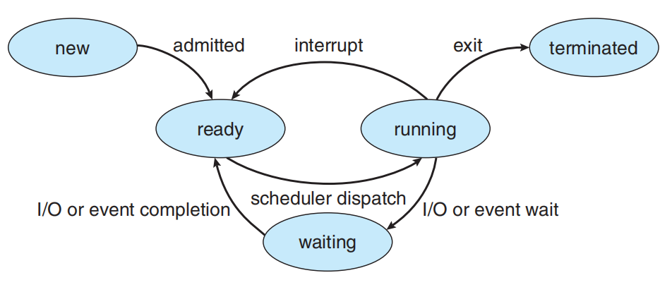
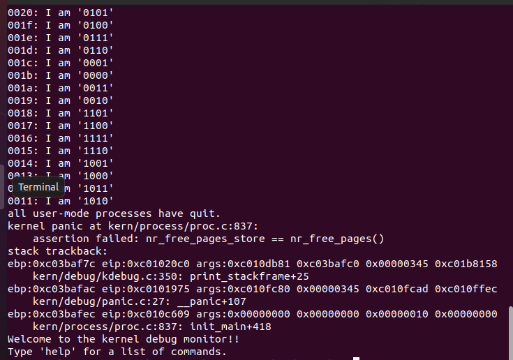
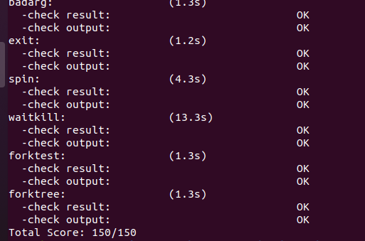

# lab5

## 先验知识

本次实验中主要涉及到的知识点有：

- 从内核态切换到用户态的方法；
- ELF可执行文件的格式；
- 用户进程的创建和管理；
- 简单的进程调度；
- 系统调用的实现；

对应的操作系统中的知识点有：

- 创建、管理、切换到用户态进程的具体实现；
- 加载ELF可执行文件的具体实现；
- 对系统调用机制的具体实现；

## 练习0：填写已有实验

- 需要修改的文件proc.c，default_pmm.c，pmm.c，swap_fifo.c，vmm.c，trap.c
- 同时根据实验要求，更改一些代码:
#### alloc_proc
```c++
//alloc_proc
static struct proc_struct *alloc_proc(void) {
    struct proc_struct *proc = kmalloc(sizeof(struct proc_struct));
    if (proc != NULL) {
        proc->state = PROC_UNINIT;  //设置进程为未初始化状态
        proc->pid = -1;             //未初始化的的进程id为-1
        proc->runs = 0;             //初始化时间片
        proc->kstack = 0;           //内存栈的地址
        proc->need_resched = 0;     //是否需要调度设为不需要
        proc->parent = NULL;        //父节点设为空
        proc->mm = NULL;            //虚拟内存设为空
        memset(&(proc->context), 0, sizeof(struct context));//上下文的初始化
        proc->tf = NULL;            //中断帧指针置为空
        proc->cr3 = boot_cr3;       //页目录设为内核页目录表的基址
        proc->flags = 0;            //标志位
        memset(proc->name, 0, PROC_NAME_LEN);//进程名
        //lab5 code begin
        proc->wait_state = 0;        //PCB 进程控制块中新增的条目，初始化进程等待状态  
        proc->cptr = proc->optr = proc->yptr = NULL;//进程相关指针初始化
        //lab5 code end
    }
    return proc;
}
```
增加代码
```
proc->wait_state = 0;//初始化进程等待状态  
proc->cptr = proc->optr = proc->yptr = NULL;//进程相关指针初始化  
```
进程控制块里面新增指针：
```bash
parent:           proc->parent  (proc is children)
children:         proc->cptr    (proc is parent)
older sibling:    proc->optr    (proc is younger sibling)
younger sibling:  proc->yptr    (proc is older sibling)
```
#### do_fork
```c
int
do_fork(uint32_t clone_flags, uintptr_t stack, struct trapframe *tf) {
    int ret = -E_NO_FREE_PROC;
    struct proc_struct *proc;
    if (nr_process >= MAX_PROCESS) {
        goto fork_out;
    }
    ret = -E_NO_MEM;
    if ((proc = alloc_proc()) == NULL) {
        goto fork_out;
    }

    proc->parent = current;
    assert(current->wait_state == 0);// Lab5: 确保当前进程的wait状态为空

    if (setup_kstack(proc) != 0) {
        goto bad_fork_cleanup_proc;
    }
    if (copy_mm(clone_flags, proc) != 0) {
        goto bad_fork_cleanup_kstack;
    }
    copy_thread(proc, stack, tf);

    bool intr_flag;
    local_intr_save(intr_flag);
    {
        proc->pid = get_pid();
        hash_proc(proc);
        set_links(proc);// Lab5: 设置进程间的关系

    }
    local_intr_restore(intr_flag);

    wakeup_proc(proc);

    ret = proc->pid;
fork_out:
    return ret;
bad_fork_cleanup_kstack:
    put_kstack(proc);
bad_fork_cleanup_proc:
    kfree(proc);
    goto fork_out;
}
```
增加代码：
```bash
assert(current->wait_state == 0); //确保进程在等待
set_links(proc); //设置进程链接
```
改动主要是上述代码中含注释的两行，第一行是为了确定当前的进程正在等待，第二行是使用`set_links`函数来设置进程之间的关系。
#### idt_init
```c
void idt_init(void) {
    extern uintptr_t __vectors[];
    int i;
    for (i = 0; i < sizeof(idt) / sizeof(struct gatedesc); i ++) {
        SETGATE(idt[i], 0, GD_KTEXT, __vectors[i], DPL_KERNEL);
    }
    SETGATE(idt[T_SYSCALL], 1, GD_KTEXT, __vectors[T_SYSCALL], DPL_USER);
    lidt(&idt_pd);
}
```
增加代码：
```bash
SETGATE(idt[T_SYSCALL], 1, GD_KTEXT, __vectors[T_SYSCALL], DPL_USER);////这里主要是设置相应的中断门
```
#### trap_dispatch
```c
ticks ++;
if (ticks % TICK_NUM == 0) {
    assert(current != NULL);
    current->need_resched = 1;
}
break;
```
增加代码：
```c
current->need_resched = 1;
```
将时间片设置为需要调度，表示当前进程的时间片已经用完。
## 练习1: 加载应用程序并执行（需要编码）
- 清空操作
1. 首先为加载新的执行码做好用户态内存空间清空准备。如果mm不为NULL，则设置页表为内核空间页表，且进一步判断mm的引用计数减1后是否为0，如果为0，则表明没有进程再需要此进程所占用的内存空间。
```c
static inline int
mm_count_dec(struct mm_struct *mm) {
    mm->mm_count -= 1;//mm的引用计数减1
    return mm->mm_count;
}
```
2. 根据mm中的记录，释放进程所占用户空间内存
```c
void
exit_mmap(struct mm_struct *mm) {//释放进程所占用户空间内存
    assert(mm != NULL && mm_count(mm) == 0);
    pde_t *pgdir = mm->pgdir;
    list_entry_t *list = &(mm->mmap_list), *le = list;
    while ((le = list_next(le)) != list) {       
        struct vma_struct *vma = le2vma(le, list_link);
        unmap_range(pgdir, vma->vm_start, vma->vm_end);
    }
    while ((le = list_next(le)) != list) {
        struct vma_struct *vma = le2vma(le, list_link);
        exit_range(pgdir, vma->vm_start, vma->vm_end);
    }
}
```
以及释放进程页表本身所占空间。
```c
// put_pgdir - free the memory space of PDT
static void
put_pgdir(struct mm_struct *mm) {//释放进程页表本身所占空间
    free_page(kva2page(mm->pgdir));
}
```
3. 最后把当前进程的mm内存管理指针为空。由于此处的initproc是内核线程，所以mm为NULL，整个处理都不会做。
```c
// mm_destroy - free mm and mm internal fields
void
mm_destroy(struct mm_struct *mm) {
    assert(mm_count(mm) == 0);

    list_entry_t *list = &(mm->mmap_list), *le;
    while ((le = list_next(list)) != list) {
        list_del(le);
        kfree(le2vma(le, list_link));  //kfree vma        
    }
    kfree(mm); //kfree mm
    mm=NULL;
}
```
- 接下来的一步是加载应用程序执行码到当前进程的新创建的用户态虚拟空间中。这里涉及到读ELF格式的文件，申请内存空间，建立用户态虚存空间，加载应用程序执行码等。load_icode函数完成了整个复杂的工作。
1. 调用mm_create函数来申请进程的内存管理数据结构mm所需内存空间，并对mm进行初始化；
```c
    //(1) create a new mm for current process
    if ((mm = mm_create()) == NULL) {
        goto bad_mm;
    }
```
2. 调用setup_pgdir来申请一个页目录表所需的一个页大小的内存空间，并把描述ucore内核虚空间映射的内核页表（boot_pgdir所指）的内容拷贝到此新目录表中，最后mm->pgdir指向此页目录表，这就是进程新的页目录表了，且能够正确映射内核。
```c
    //(2) create a new PDT, and mm->pgdir= kernel virtual addr of PDT
    if (setup_pgdir(mm) != 0) {
        goto bad_pgdir_cleanup_mm;
    }
```
3. 根据应用程序执行码的起始位置来解析此ELF格式的执行程序，并调用mm_map函数根据ELF格式的执行程序说明的各个段（代码段、数据段、BSS段等）的起始位置和大小建立对应的vma结构，并把vma插入到mm结构中，从而表明了用户进程的合法用户态虚拟地址空间。
```c
//第3步：读取ELF格式的文件，在内存中复制该进程所需要的代码段等信息
    //(3) copy TEXT/DATA section, build BSS parts in binary to memory space of process
    struct Page *page;          //申请一个页
    //(3.1) get the file header of the bianry program (ELF format)
struct elfhdr *elf = (struct elfhdr *)binary;       //获取ELF格式文件的表头
在bootloader启动的过程中，已经将ucore内核和用户代码全部加载到内存，因为没有文件管理系统，我们只需要关注这个代码在内存中的哪里，找到了开头就能根据它找到数据段。
    //(3.2) get the entry of the program section headers of the bianry program (ELF format)
struct proghdr *ph = (struct proghdr *)(binary + elf->e_phoff);
//(3.3) This program is valid?
    if (elf->e_magic != ELF_MAGIC) {        //这个ELF文件的格式是否是合法的？
        ret = -E_INVAL_ELF;             //返回一个ELF文件非法操作
        goto bad_elf_cleanup_pgdir;
    }
    uint32_t vm_flags, perm;
    struct proghdr *ph_end = ph + elf->e_phnum;
    for (; ph < ph_end; ph ++) {
    //(3.4) find every program section headers
        if (ph->p_type != ELF_PT_LOAD) {
            continue ;
        }
        if (ph->p_filesz > ph->p_memsz) {
            ret = -E_INVAL_ELF;
            goto bad_cleanup_mmap;
        }
        if (ph->p_filesz == 0) {
            continue ;
        }
//这个地方获取的是文件的各个段，包括代码段、数据段等。
//(3.5) call mm_map fun to setup the new vma ( ph->p_va, ph->p_memsz)
根据获取的各个段的开头，以及虚拟地址创建VMA（管理进程所认为的合法空间）
一开始给各个段赋予了一些属性：
 
        vm_flags = 0, perm = PTE_U;
        if (ph->p_flags & ELF_PF_X) vm_flags |= VM_EXEC;        //可执行属性（代码段）
        if (ph->p_flags & ELF_PF_W) vm_flags |= VM_WRITE;       //可读可写（数据段）
        if (ph->p_flags & ELF_PF_R) vm_flags |= VM_READ;
        if (vm_flags & VM_WRITE) perm |= PTE_W;
        if ((ret = mm_map(mm, ph->p_va, ph->p_memsz, vm_flags, NULL)) != 0) {
            goto bad_cleanup_mmap;
        }
//使用mm_map函数建立合法空间（kern/mm/vmm.c，159——165行）
```
4. 调用根据执行程序各个段的大小分配物理内存空间，并根据执行程序各个段的起始位置确定虚拟地址，并在页表中建立好物理地址和虚拟地址的映射关系，然后把执行程序各个段的内容拷贝到相应的内核虚拟地址中，至此应用程序执行码和数据已经根据编译时设定地址放置到虚拟内存中了；
```c
//(3.6) alloc memory, and  copy the contents of every program section (from, from+end) to process's memory (la, la+end)
        end = ph->p_va + ph->p_filesz;
        //(3.6.1) copy TEXT/DATA section of bianry program
//这里是拷贝内容，memcpy是拷贝函数
        while (start < end) {
            if ((page = pgdir_alloc_page(mm->pgdir, la, perm)) == NULL) {
                goto bad_cleanup_mmap;
            }
            off = start - la, size = PGSIZE - off, la += PGSIZE;
            if (end < la) {
                size -= la - end;
            }
            memcpy(page2kva(page) + off, from, size);//拷贝函数
            start += size, from += size;
        }
//(3.6.2) build BSS section of binary program
//执行程序的BSS段需要清空，这里全部设置为0
        end = ph->p_va + ph->p_memsz;
        if (start < la) {
            /* ph->p_memsz == ph->p_filesz */
            if (start == end) {
                continue ;
            }
            off = start + PGSIZE - la, size = PGSIZE - off;
            if (end < la) {
                size -= la - end;
            }
            memset(page2kva(page) + off, 0, size);//设置为0
            start += size;
            assert((end < la && start == end) || (end >= la && start == la));
        }
        while (start < end) {
            if ((page = pgdir_alloc_page(mm->pgdir, la, perm)) == NULL) {
                goto bad_cleanup_mmap;
            }
            off = start - la, size = PGSIZE - off, la += PGSIZE;
            if (end < la) {
                size -= la - end;
            }
            memset(page2kva(page) + off, 0, size);
            start += size;
        }
    }
```
5. 需要给用户进程设置用户栈，为此调用mm_mmap函数建立用户栈的vma结构，明确用户栈的位置在用户虚空间的顶端，大小为256个页，即1MB，并分配一定数量的物理内存且建立好栈的虚地址<-->物理地址映射关系；
```c
//(4) build user stack memory
//除了数据段、代码段、进程还需要用户堆栈空间。这里是构造用户堆栈。
    vm_flags = VM_READ | VM_WRITE | VM_STACK;
    if ((ret = mm_map(mm, USTACKTOP - USTACKSIZE, USTACKSIZE, vm_flags, NULL)) != 0)    {
        goto bad_cleanup_mmap;
}
//重新建立mm_map堆栈
    assert(pgdir_alloc_page(mm->pgdir, USTACKTOP-PGSIZE , PTE_USER) != NULL);
    assert(pgdir_alloc_page(mm->pgdir, USTACKTOP-2*PGSIZE , PTE_USER) != NULL);
    assert(pgdir_alloc_page(mm->pgdir, USTACKTOP-3*PGSIZE , PTE_USER) != NULL);
    assert(pgdir_alloc_page(mm->pgdir, USTACKTOP-4*PGSIZE , PTE_USER) != NULL);
```
6. 至此,进程内的内存管理vma和mm数据结构已经建立完成，于是把mm->pgdir赋值到cr3寄存器中，即更新了用户进程的虚拟内存空间，此时的initproc已经被hello的代码和数据覆盖，成为了第一个用户进程，但此时这个用户进程的执行现场还没建立好；
```c
    //(5) set current process's mm, sr3, and set CR3 reg = physical addr of Page Directory
    mm_count_inc(mm);
    current->mm = mm;
    current->cr3 = PADDR(mm->pgdir);
    lcr3(PADDR(mm->pgdir));
```
7. 先清空进程的中断帧，再重新设置进程的中断帧，使得在执行中断返回指令“iret”后，能够让CPU转到用户态特权级，并回到用户态内存空间，使用用户态的代码段、数据段和堆栈，且能够跳转到用户进程的第一条指令执行，并确保在用户态能够响应中断；
```c
//完成一个优先级的转变，从内核态切换到用户态（特权级从0到3）实现部分
    tf->tf_cs = USER_CS;
    tf->tf_ds = tf->tf_es = tf->tf_ss = USER_DS;
    tf->tf_esp = USTACKTOP;
    tf->tf_eip = elf->e_entry;
    tf->tf_eflags = FL_IF;
/*tf是一个是中断帧的指针，总是指向内核栈的某个位置：当进程从用户空间跳到内核空间时，中断帧记录了进程在被中断前的状态。当内核需要跳回用户空间时，需要调整中断帧以恢复让进程继续执行的各寄存器值。
其定义在（kern/trap/trap.h，60——82行）。
1、将tf_cs设置为用户态，这个定义在（kern/mm/memlayout.h，第21行），有一个宏定义已经定义了用户态和内核态。
2、tf_ds=tf_es=tf_ss也需要设置为用户态：定义在（kern/mm/memlayout.h，第26行）
3、需要将esp设置为用户栈的栈顶，直接使用之前建立用户栈时的参数USTACKTOP就可以。
4、eip是程序的入口，elf类的e_entry函数直接声明了，直接使用。
5、FL_IF打开中断。*/
```

总结下来：

**do_execv**函数调用load_icode（位于kern/process/proc.c中）来加载并解析一个处于内存中的ELF执行文件格式的应用程序，建立相应的用户内存空间来放置应用程序的代码段、数据段等，且要设置好proc_struct结构中的成员变量trapframe中的内容，确保在执行此进程后，能够从应用程序设定的起始执行地址开始执行。需设置正确的trapframe内容。

### 回答问题

描述当创建一个用户态进程并加载了应用程序后，CPU 是如何让这个应用程序最终在用户态执行起来的。即这个用户态进程被 ucore 选择占用 CPU 执行（RUNNING 态）到具体执行应用程序第一条指令的整个经过。

> 1. 在经过调度器占用了 CPU 的资源之后，用户态进程调用了 exec 系统调用，从而转入到了系统调用的处理例程；
> 2. 在经过了正常的中断处理例程之后，最终控制权转移到了 syscall.c 中的 syscall 函数，然后根据系统调用号转移给了 sys_exec 函数，在该函数中调用了上文中提及的 do_execve 函数来完成指定应用程序的加载；
> 3. 在do_execve中进行了若干设置，包括推出当前进程的页表，换用 kernel 的 PDT(页目录) 之后，使用 load_icode 函数，完成了对整个用户线程内存空间的初始化，包括堆栈的设置以及将 ELF 可执行文件的加载，之后通过 current->tf 指针修改了当前系统调用的 trapframe，使得最终中断返回的时候能够切换到用户态，并且同时可以正确地将控制权转移到应用程序的入口处；
> 4. 在完成了 do_exec 函数之后，进行正常的中断返回的流程，由于中断处理例程的栈上面的 eip 已经被修改成了应用程序的入口处，而 CS 上的 CPL 是用户态，因此 iret 进行中断返回的时候会将堆栈切换到用户的栈，并且完成特权级的切换，并且跳转到要求的应用程序的入口处；
> 5. 接下来开始具体执行应用程序的第一条指令；

## 练习2: 父进程复制自己的内存空间给子进程（需要编码）
copy_range函数的调用过程：do_fork()---->copy_mm()---->dup_mmap()---->copy_range()

其中，do_fork函数调用的copy_mm函数在实验四中没有实现，其他的过程和实验四一样，都是创建一个进程，并放入CPU中调度，而本次我们主要关注的是父子进程之间如何拷贝内存。

copy_mm函数：

```c
static int copy_mm(uint32_t clone_flags, struct proc_struct *proc) {
    struct mm_struct *mm, *oldmm = current->mm;
 
    /* current is a kernel thread */
    if (oldmm == NULL) {        //当前进程内存为空，返回0，复制失败
        return 0;
    }
    if (clone_flags & CLONE_VM) {       //如果共享内存标记位为真，那么可以共享内存
        mm = oldmm;
        goto good_mm;
    }
 
    int ret = -E_NO_MEM;
    if ((mm = mm_create()) == NULL) {       //如果创建地址空间失败，报错
        goto bad_mm;
    }
    if (setup_pgdir(mm) != 0) { //如果创建页表失败报错（kern/process/proc.c，288行）
        goto bad_pgdir_cleanup_mm;
    }
 
    lock_mm(oldmm);     //这是一个互斥锁，用于避免多个进程同时访问内存
    {
        ret = dup_mmap(mm, oldmm);      //下一层调用
    }
    unlock_mm(oldmm);
 
    if (ret != 0) {
        goto bad_dup_cleanup_mmap;
}
good_mm:
    mm_count_inc(mm);
    proc->mm = mm;
    proc->cr3 = PADDR(mm->pgdir);
    return 0;
bad_dup_cleanup_mmap:
    exit_mmap(mm);
    put_pgdir(mm);
bad_pgdir_cleanup_mm:
    mm_destroy(mm);
bad_mm:
    return ret;
}
```

dup_mmap函数：

```c
int dup_mmap(struct mm_struct *to, struct mm_struct *from) 
{
    assert(to != NULL && from != NULL);         //首先确保两块东西创建成功
    list_entry_t *list = &(from->mmap_list), *le = list;        //获取from的首地址
    while ((le = list_prev(le)) != list) {          //对所有段都遍历一遍
        struct vma_struct *vma, *nvma;
        vma = le2vma(le, list_link);        //获取某一段信息，并创建到新进程中
        nvma = vma_create(vma->vm_start, vma->vm_end, vma->vm_flags);
        if (nvma == NULL) {
            return -E_NO_MEM;
        }
        insert_vma_struct(to, nvma);            //把这一个段插入到子进程内存中
        bool share = 0;
        if (copy_range(to->pgdir, from->pgdir, vma->vm_start, vma->vm_end, share) != 0) {           //调用copy_range函数
            return -E_NO_MEM;
        }
    }
    return 0;
}
```
在上一个函数copy_mm中，传入的两个内存叫做mm和oldmm，其中，第一个mm只是调用了mm_create()声明，但没有初始化，更没有分配内容；第二个oldmm是current进程的内存空间，由此可见，前一个mm是待复制的内存，而复制的源内容在oldmm（父进程）内容中。

copy_range函数：

在上一个函数中（dup_mmap），只是完成了新进程中的段创建，但是段中还没有具体内容，需要在copy_range中具体复制父进程对应段中的具体内容。这个函数传入的参数都是段指针，告诉系统应该复制内存中需要复制内容的起止地址。
```c
int copy_range(pde_t *to, pde_t *from, uintptr_t start, uintptr_t end, bool share) {
    ......
    ......    
    void * kva_src = page2kva(page);//返回父进程的内核虚拟页地址  
    void * kva_dst = page2kva(npage);//返回子进程的内核虚拟页地址  
    memcpy(kva_dst, kva_src, PGSIZE);//复制父进程到子进程  
    ret = page_insert(to, npage, start, perm);//建立子进程页地址起始位置与物理地址的映射关系(prem是权限)  
    ......
    ......
```
### 回答问题

请在实验报告中简要说明如何设计实现 ”Copy on Write 机制“，给出概要设计，鼓励给出详细设计。

> Copy-on-write（简称COW）的基本概念是指如果有多个使用者对一个资源A（比如内存块）进行读操作，则每个使用者只需获得一个指向同一个资源A的指针，就可以读取该资源了。若某使用者需要对这个资源A进行写操作，系统会对该资源进行拷贝操作，从而使得该“写操作”使用者获得一个该资源A的“私有”拷贝—资源B，可对资源B进行写操作。该“写操作”使用者对资源B的改变对于其他的使用者而言是不可见的，因为其他使用者看到的还是资源A。

#### Copy on Write机制思想

- `Copy on Write` 机制的主要思想为使得进程执行 fork 系统调用进行复制的时候，父进程不会简单地将整个内存中的内容复制给子进程，而是暂时共享相同的物理内存页；
- 而当其中一个进程需要对内存进行修改的时候，再额外创建一个自己私有的物理内存页，将共享的内容复制过去，然后在自己的内存页中进行修改；

#### 实现思路

根据上述分析，主要对实验框架的修改应当主要有两个部分，一个部分在于进行 fork 操作的时候不直接复制内存，另外一个处理在于出现了内存页访问异常的时候，会将共享的内存页复制一份，然后在新的内存页进行修改，具体的修改部分如下：

- do fork 部分：

  在进行内存复制的部分，比如 copy_range 函数内部，不实际进行内存的复制，而是将子进程和父进程的虚拟页映射上同一个物理页面，然后在分别在这两个进程的虚拟页对应的 PTE 部分将这个页置成是不可写的，同时利用 PTE 中的保留位将这个页设置成共享的页面，这样的话如果应用程序试图写某一个共享页就会产生页访问异常，从而可以将控制权交给操作系统进行处理；

- page fault 部分：

  在 page fault 的 ISR 部分，新增加对当前的异常是否由于尝试写了某一个共享页面引起的，如果是的话，额外申请分配一个物理页面，然后将当前的共享页的内容复制过去，建立出错的线性地址与新创建的物理页面的映射关系，将 PTE 设置设置成非共享的；然后查询原先共享的物理页面是否还是由多个其它进程共享使用的，如果不是的话，就将对应的虚地址的 PTE 进行修改，删掉共享标记，恢复写标记；这样的话 page fault 返回之后就可以正常完成对虚拟内存（原想的共享内存）的写操作了；


## 练习3: 阅读分析源代码，理解进程执行 fork/exec/wait/exit 的实现，以及系统调用的实现（不需要编码）

请在实验报告中简要说明你对 fork/exec/wait/exit函数的分析。并回答如下问题：

- 请分析fork/exec/wait/exit在实现中是如何影响进程的执行状态的？
- 请给出ucore中一个用户态进程的执行状态生命周期图（包执行状态，执行状态之间的变换关系，以及产生变换的事件或函数调用）。（字符方式画即可）

### fork

调用过程为：`fork->SYS_fork->do_fork+wakeup_proc`

首先当程序执行 fork 时，fork 使用了系统调用 SYS_fork，而系统调用 SYS_fork 则主要是由 do_fork 和 wakeup_proc 来完成的。do_fork() 完成的工作在练习 2 及 lab4 中已经做过详细介绍，这里再简单说一下，主要是完成了以下工作：

- 1、分配并初始化进程控制块（ alloc_proc 函数）;
- 2、分配并初始化内核栈，为内核进程（线程）建立栈空间（ setup_stack 函数）;
- 3、根据 clone_flag 标志复制或共享进程内存管理结构（ copy_mm 函数）;
- 4、设置进程在内核（将来也包括用户态）正常运行和调度所需的中断帧和执行上下文 （ copy_thread 函数）;
- 5、为进程分配一个 PID（ get_pid() 函数）;
- 6、把设置好的进程控制块放入 hash_list 和 proc_list 两个全局进程链表中;
- 7、自此，进程已经准备好执行了，把进程状态设置为“就绪”态;
- 8、设置返回码为子进程的 PID 号。

而 wakeup_proc 函数主要是将进程的状态设置为等待，即 proc->wait_state = 0

lab5中的`do_fork`函数与lab4中的实现类似，所不同的是lab5中使用`set_links(proc)`函数来设置进程间的关系，而不是简单的`list_add`与`nr_process++`。

`set_links`函数会为当前进程间设置合适的关系，其实现如下：

```c
/*************************************************************
process relations
parent:           proc->parent  (proc is children)
children:         proc->cptr    (proc is parent)
older sibling:    proc->optr    (proc is younger sibling)
younger sibling:  proc->yptr    (proc is older sibling)
*************************************************************/
// set_links - set the relation links of process
static void set_links(struct proc_struct *proc) {
    list_add(&proc_list, &(proc->list_link));
    proc->yptr = NULL;
    if ((proc->optr = proc->parent->cptr) != NULL)
        proc->optr->yptr = proc;
    proc->parent->cptr = proc;
    nr_process ++;
}
```

* 除了lab4熟知的`list_add`与`nr_process++`，该函数还设置了`proc_struct`中的`optr、yptr`以及`cptr`成员。

* 其中，`cptr`指针指向当前进程的子进程中，**最晚创建**的那个子进程，即`children`；`yptr`指向**与当前进程共享同一个父进程，但比当前进程的创建时间更晚的进程**，即`younger sibling`。而`optr`指针的功能则与`yptr`相反，指向`older sibling`。

* 进程间关系如下图所示

  ```c
                       +----------------+
                       | parent process |
                       +----------------+
                parent ^         \       ^  parent
                      /           \       \
                     /             \ cptr  \
                    /         yptr  V       \      yptr
             +-------------+  -->  +-------------+  -->  NULL
             | old process |       | New Process |
  NULL  <--  +-------------+  <--  +-------------+
        optr                  optr
  ```

### exec

调用过程为：`SYS_exec->do_execve`

当应用程序执行的时候，会调用 SYS_exec 系统调用，而当 ucore 收到此系统调用的时候，则会使用 do_execve() 函数来实现，因此这里我们主要介绍 do_execve() 函数的功能，函数主要时完成用户进程的创建工作，同时使用户进程进入执行。 

主要工作如下：

- 1、首先为加载新的执行码做好用户态内存空间清空准备。如果 mm 不为 NULL，则设置页表为内核空间页表，且进一步判断 mm 的引用计数减 1 后是否为 0，如果为 0，则表明没有进程再需要此进程所占用的内存空间，为此将根据 mm 中的记录，释放进程所占用户空间内存和进程页表本身所占空间。最后把当前进程的 mm 内存管理指针为空。
- 2、接下来是加载应用程序执行码到当前进程的新创建的用户态虚拟空间中。之后就是调用 load_icode 从而使之准备好执行。（具体 load_icode 的功能在练习 1 已经介绍的很详细了，这里不赘述了）

### wait

调用过程为：`SYS_wait->do_wait`

当执行wait功能的时候，会调用系统调用SYS_wait，而该系统调用的功能则主要由do_wait函数实现，主要工作就是父进程如何完成对子进程的最后回收工作，具体的功能实现如下：

1. 如果 pid!=0，表示只找一个进程 id 号为 pid 的退出状态的子进程，否则找任意一个处于退出状态的子进程;

2. 如果此子进程的执行状态不为PROC_ZOMBIE，表明此子进程还没有退出，则当前进程设置执行状态为PROC_SLEEPING（睡眠），睡眠原因为WT_CHILD(即等待子进程退出)，调用schedule()函数选择新的进程执行，自己睡眠等待，如果被唤醒，则重复跳回步骤 1 处执行;

3. 如果此子进程的执行状态为 PROC_ZOMBIE，表明此子进程处于退出状态，需要当前进程(即子进程的父进程)完成对子进程的最终回收工作，即首先把子进程控制块从两个进程队列proc_list和hash_list中删除，并释放子进程的内核堆栈和进程控制块。自此，子进程才彻底地结束了它的执行过程，它所占用的所有资源均已释放。

我们可以看看 do_wait 函数的实现过程：

```c
int do_wait(int pid, int *code_store) {
    struct mm_struct *mm = current->mm;
    if (code_store != NULL) {
        if (!user_mem_check(mm, (uintptr_t)code_store, sizeof(int), 1)) {
            return -E_INVAL;
        }
    }
    struct proc_struct *proc;
    bool intr_flag, haskid;
repeat:
    haskid = 0;
    //如果pid！=0，则找到进程id为pid的处于退出状态的子进程 
    if (pid != 0) {
        proc = find_proc(pid);
        if (proc != NULL && proc->parent == current) {
            haskid = 1;
            if (proc->state == PROC_ZOMBIE) {
                goto found; //找到进程
            }
        }
    }
    else {
      //如果pid==0，则随意找一个处于退出状态的子进程
        proc = current->cptr;
        for (; proc != NULL; proc = proc->optr) {
            haskid = 1;
            if (proc->state == PROC_ZOMBIE) {
                goto found;
            }
        }
    }
    if (haskid) {//如果没找到，则父进程重新进入睡眠，并重复寻找的过程
        current->state = PROC_SLEEPING;
        current->wait_state = WT_CHILD;
        schedule();
        if (current->flags & PF_EXITING) {
            do_exit(-E_KILLED);
        }
        goto repeat;
    }
    return -E_BAD_PROC;
    
//释放子进程的所有资源 
found:
    if (proc == idleproc || proc == initproc) {
        panic("wait idleproc or initproc.\n");
    }
    if (code_store != NULL) {
        *code_store = proc->exit_code;
    }
    local_intr_save(intr_flag);
    {
        unhash_proc(proc);//将子进程从hash_list中删除
        remove_links(proc);//将子进程从proc_list中删除 
    }
    local_intr_restore(intr_flag);
    put_kstack(proc); //释放子进程的内核堆栈
    kfree(proc);  //释放子进程的进程控制块
    return 0;
}
```

### exit

调用过程为：`SYS_exit->exit`

当执行 exit 功能的时候，会调用系统调用 SYS_exit，而该系统调用的功能主要是由 do_exit 函数实现。具体过程如下：

1. 先判断是否是用户进程，如果是，则开始回收此用户进程所占用的用户态虚拟内存空间;（具体的回收过程不作详细说明）

2. 设置当前进程状态为 PROC_ZOMBIE，然后设置当前进程的退出码为 error_code。表明此时这个进程已经无法再被调度了，只能等待父进程来完成最后的回收工作（主要是回收该子进程的内核栈、进程控制块）

3. 如果当前父进程已经处于等待子进程的状态，即父进程的 wait_state 被置为 WT_CHILD，则此时就可以唤醒父进程，让父进程来帮子进程完成最后的资源回收工作。

4. 如果当前进程还有子进程,则需要把这些子进程的父进程指针设置为内核线程 init，且各个子进程指针需要插入到 init 的子进程链表中。如果某个子进程的执行状态是 PROC_ZOMBIE，则需要唤醒 init 来完成对此子进程的最后回收工作。

5. 执行 schedule() 调度函数，选择新的进程执行。

该函数的功能简单的说就是，回收当前进程所占的大部分内存资源,并通知父进程完成最后的回收工作。

我们可以看看 do_exit 函数的实现过程：

```c
int do_exit(int error_code) {
    // 判断是否为idleproc或initproc内核线程
    if (current == idleproc) {
        panic("idleproc exit.\n");
    }
    if (current == initproc) {
        panic("initproc exit.\n");
    }
    struct mm_struct *mm = current->mm;
    if (mm != NULL) { //如果该进程是用户进程
        lcr3(boot_cr3); //切换到内核态的页表
        if (mm_count_dec(mm) == 0){
            exit_mmap(mm); 
/*如果没有其他进程共享这个内存释放current->mm->vma链表中每个vma描述的进程合法空间中实际分配的内存，那么把对应的页表项内容清空，最后还把页表所占用的空间释放并把对应的页目录表项清空*/
            put_pgdir(mm); //释放页目录占用的内存 
            mm_destroy(mm); //释放mm占用的内存
        }
        current->mm = NULL; //虚拟内存空间回收完毕
    }
    current->state = PROC_ZOMBIE; //僵死状态
    current->exit_code = error_code;//等待父进程做最后的回收
    bool intr_flag;
    struct proc_struct *proc;
    // 唤醒父进程帮助完成子进程的回收
    local_intr_save(intr_flag);
    {
        proc = current->parent;
        if (proc->wait_state == WT_CHILD) {
            wakeup_proc(proc); //如果父进程在等待子进程，则唤醒
        }
        while (current->cptr != NULL) {
 /*如果当前进程还有子进程，则需要把这些子进程的父进程指针设置为内核线程initproc，且各个子进程指针需要插入到initproc的子进程链表中。如果某个子进程的执行状态是PROC_ZOMBIE，则需要唤醒initproc来完成对此子进程的最后回收工作。*/
            proc = current->cptr;
            current->cptr = proc->optr;         
            proc->yptr = NULL;
            if ((proc->optr = initproc->cptr) != NULL) {
                initproc->cptr->yptr = proc;
            }
            proc->parent = initproc;
            initproc->cptr = proc;
            if (proc->state == PROC_ZOMBIE) {
                if (initproc->wait_state == WT_CHILD) {
                    wakeup_proc(initproc);
                }
            }
        }
    }
    local_intr_restore(intr_flag);
    schedule(); //选择新的进程执行
    panic("do_exit will not return!! %d.\n", current->pid);
}
```

### 回答问题

> 1.请分析 fork/exec/wait/exit 在实现中是如何影响进程的执行状态的？

- fork 执行完毕后，如果创建新进程成功，则出现两个进程，一个是子进程，一个是父进程。在子进程中，fork 函数返回 0，在父进程中，fork 返回新创建子进程的进程 ID。我们可以通过 fork 返回的值来判断当前进程是子进程还是父进程。fork 不会影响当前进程的执行状态，但是会将子进程的状态标记为 RUNNALB，使得可以在后续的调度中运行起来；
- exec 完成用户进程的创建工作。首先为加载新的执行码做好用户态内存空间清空准备。接下来的一步是加载应用程序执行码到当前进程的新创建的用户态虚拟空间中。exec 不会影响当前进程的执行状态，但是会修改当前进程中执行的程序；
- wait 是等待任意子进程的结束通知。wait_pid 函数等待进程 id 号为 pid 的子进程结束通知。这两个函数最终访问 sys_wait 系统调用接口让 ucore 来完成对子进程的最后回收工作。wait 系统调用取决于是否存在可以释放资源（ZOMBIE）的子进程，如果有的话不会发生状态的改变，如果没有的话会将当前进程置为 SLEEPING 态，等待执行了 exit 的子进程将其唤醒；
- exit 会把一个退出码 error_code 传递给 ucore，ucore 通过执行内核函数 do_exit 来完成对当前进程的退出处理，主要工作简单地说就是回收当前进程所占的大部分内存资源，并通知父进程完成最后的回收工作。exit 会将当前进程的状态修改为 ZOMBIE 态，并且会将父进程唤醒（修改为RUNNABLE），然后主动让出 CPU 使用权；

> 2.请给出 ucore 中一个用户态进程的执行状态生命周期图（包执行状态，执行状态之间的变换关系，以及产生变换的事件或函数调用）。（字符方式画即可）

首先，我们梳理一下流程：



最终，我们可以画出执行状态图如下所示：


## 实验结果


在tools/grade.sh中注释以下内容
```bash
            if [ $found -eq $not ]; then
                if [ $found -eq 0 ]; then
                    msg="!! error: missing '$i'"
                else
                    msg="!! error: got unexpected line '$i'"
                fi
                okay=no
                if [ -z "$error" ]; then
                    error="$msg"
                else
                    error="$error\n$msg"
                fi
            fi
```


## 实验总结
本次实验主要针对进程。在学习进程的过程中，老师曾经讲过进程的五个状态：创建、就绪、运行、阻塞、终结。进程的创建一般通过API-fork实现，进程的终结可以通过API-exit实现。当进程处于就绪态的时候，OS会通过调度算法将就绪列表中的一个就绪态进程更改为运行态，同时将运行中的进程更改为就绪态，从而使得每一个进程都能够拥有使用CPU的机会，处于运行态的进程接受来自I/O设备的中断，会进入阻塞状态，操作系统此时也会调度其它的进程占用CPU，保证CPU的利用率。本次实验中，我们还看到了ucore如何实现fork、exec、wait和exit的具体代码。其中，我们对于ZOMBIE状态下的进程和孤儿进程的回收做了细致的了解与分析。父进程无法回收的孤儿进程最终交由内核进程init_proc接管与回收来避免资源的浪费。

同时本次实验也明白了用户进程与内核线程的区别，内核线程的管理实现相对是简单的，内核线程无需考虑用户空间和实际物理空间的转换，因为程序员在编写操作系统的时候就需要考虑到有限的地址空间，保证各个内核线程执行过程中不会相互影响。

而用户进程，我们的进程空间都是远远大于内存的，这就势必会使得我们需要选取相应的物理页进行替换，以及在用户进程切换的时候我们需要考虑到各个特权级用户态的切换，在处理中断的时候，我们除了考虑时钟的中断还需要考虑用户自己主动陷入内核放弃使用cpu等诸多情况。
