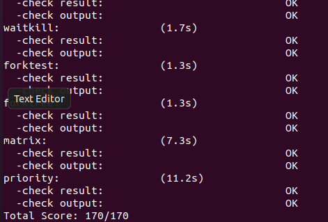
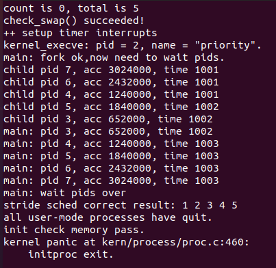

# lab6
## 一、实验内容
实验五完成了用户进程的管理，可在用户态运行多个进程。但到目前为止，采用的调度策略是很简单的FIFO调度策略。本次实验，主要是熟悉ucore的系统调度器框架， 以及基于此框架的Round-Robin（RR） 调度算法。然后参考RR调度算法的实现，完成Stride Scheduling调度算法。    
## 二、目的
理解操作系统的调度管理机制

熟悉 ucore 的系统调度器框架，以及缺省的Round-Robin 调度算法

基于调度器框架实现一个(Stride Scheduling)调度算法来替换缺省的调度算法

## 三、实验设计思想和流程
 
#### 练习0：填写已有实验

本实验依赖实验1/2/3/4/5。请把你做的实验2/3/4/5的代码填入本实验中代码中有“LAB1”/“LAB2”/“LAB3”/“LAB4”“LAB5”的注释相应部分。并确保编译通过。注意：为了能够正确执行lab6的测试应用程序，可能需对已完成的实验1/2/3/4/5的代码进行进一步改进。

本次实验的主要内容是完成进程调度。在之前的实验中，ucore遍历进程队列（进程池），找到一个处在Runnable状态的进程并将它调度，但是本次实验中需要用到RR算法和Stride算法。

使用meld比较软件，发现以下文件需要更改：

proc.c

default_pmm.c

pmm.c

swap_fifo.c

vmm.c

trap.c
需要修改的部分如下：

1、alloc_proc函数需要新增成员（kern/process/proc.c，86——128行）

更改部分为120——125行：
```c 
proc->rq = NULL;                     //初始化运行队列为空
list_init(&(proc->run_link));        //初始化运行队列的指针
proc->time_slice = 0;                //初始化时间片
proc->lab6_run_pool.left = proc->lab6_run_pool.right proc->lab6_run_pool.parent = NULL;//初始化各类指针为空，包括父进程等待
proc->lab6_stride = 0;			//进程运行进度初始化（针对于stride调度算法，下同）
proc->lab6_priority = 0;		//初始化优先级
相关的解释和定义可以在（kern/process/proc.h，61——66行）找到：
```
参数的解释是：   
rq：当前的进程在队列中的指针；

run_link：运行队列的指针；

time_slice：时间片；

lab6_stride：代表现在执行到了什么地方（stride调度算法，下同）；

lab6_priority：进程优先级。

#### 练习1: 使用 Round Robin 调度算法（不需要编码）

- 在lab5中当系统没有进程可以执行的时候，它会把所有 cpu 时间用在搜索进程池，以实现 idle的目的，而在此次实验中，ucore建立了一个单独的进程(kern/process/proc.c 中的 idleproc)作为 cpu 空闲时的 idle 进程
- 现在假定在执行某进程A的用户代码时，出现了一个 trap (例如是一个外设产生的中断)，这个时候就会从进程A的用户态切换到内核态，并且保存好进程A的trapframe（以上过程在trap.c中均有体现）当内核态处理中断时需要判断是否需要进行其他进程调度（在lab5中就是每100个ticks就进行下一个进程的调度，而调度的方法就是寻找下一个runable的进程，而lab6中在练习1中采用的是轮转调度策略）挑选下一个可调度的进程。
```c
    case IRQ_OFFSET + IRQ_TIMER:
#if 0
#endif
        ticks ++;
        assert(current != NULL);
        sched_class_proc_tick(current);
        break;
```
- Round Robin调度算法的调度思想是让所有 runnable 态的进程分时轮流使用 CPU 时间。Round Robin 调度器维护当前 runnable进程的有序运行队列。当前进程的时间片用完之后,调度器将当前进程放置到运行队列的尾部，再从其头部取出进程进行调度。
- 我们还需要了解这个练习中涉及的数据结构，我们需要知道所有就绪队列是通过双向链表进行链接，双向链表的头存在run_queue类型的rq中的run_list（也就是它的成员变量run_list通过它轮转找到下一个想要运行的进程），双向链表的元素是进程控制块proc中的成员变量list_entry_t类型的run_link，很明显run_link并不是进程控制块proc，只是它的成员变量，所以如果最终要返回proc还需要进行一个转换，这个转换就是*le2proc*，后面会有对其的讲解。       
具体实现如下：     
这里Round Robin调度算法的主要实现需要的函数在default_sched.c之中：
```c
static void RR_init(struct run_queue *rq) 
static void RR_enqueue(struct run_queue *rq, struct proc_struct *proc) 
static void RR_dequeue(struct run_queue *rq, struct proc_struct *proc) 
static struct proc_struct * RR_pick_next(struct run_queue *rq) 
static void RR_proc_tick(struct run_queue *rq, struct proc_struct *proc) 
```
现在逐个函数进行分析，从而了解Round Robin调度算法的原理。
首先是RR_init函数，进行run_queue队列的初始化。
```c
static void
RR_init(struct run_queue *rq) {
    list_init(&(rq->run_list));
    rq->proc_num = 0;
}
```
然后是RR_enqueue函数，
```c
static void RR_enqueue(struct run_queue *rq, struct proc_struct *proc) {
    assert(list_empty(&(proc->run_link)));
    list_add_before(&(rq->run_list), &(proc->run_link));
    if (proc->time_slice == 0 || proc->time_slice > rq->max_time_slice) {
        proc->time_slice = rq->max_time_slice;
    }
    proc->rq = rq;
    rq->proc_num ++;
}
```
一个新的RUNNABLE的进程需要重新加入到rq队列中，于是将他（proc的run_link对应的就是该进程）使用list_add_before加入到rq队列的pre位置（相当于rq队列的尾部，因为是双向链表，rq是头每次取rq的next的进程控制块），然后如果进程控制块的时间片为0（表示当前进程的时间片已经用完，需要更新时间片以便下次调用该进程又有时间片可以执行），则需要把它重置为max_time_slice。最后再依次调整当前进程的rq以及rq的进程数目加一。

然后是RR_dequeue函数
```c
static void
RR_dequeue(struct run_queue *rq, struct proc_struct *proc) {
    assert(!list_empty(&(proc->run_link)) && proc->rq == rq);
    list_del_init(&(proc->run_link));
    rq->proc_num --;
}
```
就是简单的把就绪进程队列rq中的proc进程控制块控制的进程（proc的成员变量run_link）从队列中删除，然后使就绪进程个数的proc_num减一。

接下来是RR_pick_next函数。
```c
static struct proc_struct *RR_pick_next(struct run_queue *rq) {
    list_entry_t *le = list_next(&(rq->run_list));
    if (le != &(rq->run_list)) {
        return le2proc(le, run_link);
    }
    return NULL;
}
```
选取就绪进程队列rq中的下一个元素，并把队列元素转换成进程控制块指针，即置为当前占用CPU的程序。
```c
#define le2proc(le, member)         \
    to_struct((le), struct proc_struct, member)

#define to_struct(ptr, type, member)                               \
    ((type *)((char *)(ptr) - offsetof(type, member)))
```
le2proc可以理解为通过成员变量相对于结构体的偏移量找到proc的指针，具体来讲就是说结构体在内存里面是连续的，我知道其中一个成员变量的位置那么我就能通过这个成员变量相对于结构体proc的偏移量找到proc的位置，从而返回这个进程控制块。

最后是
```c
static void RR_proc_tick(struct run_queue *rq, struct proc_struct *proc) {  
    if (proc->time_slice > 0) {  
        proc->time_slice --;  
    }  
    if (proc->time_slice == 0) {  
        proc->need_resched = 1;  
    }  
}  
```
观察代码，即每一次时间片到时的时候，当前执行进程的时间片time_slice便减一。如果time_slice降到零，则设置此进程成员变量need_resched标识为1，这样在下一次中断来后执行trap函数时，会由于当前进程程成员变量need_resched标识为1而执行schedule函数，从而把当前执行进程放回就绪队列末尾，而从就绪队列头取出在就绪队列上等待时间最久的那个就绪进程执行。

1. 请理解并分析sched_calss中各个函数指针的用法，并接合Round Robin 调度算法描ucore的调度执行过程。
查看一下 sched_class 类中的内容：
```c
struct sched_class {
  const char *name;// 调度器的名字
  void (*init) (struct run_queue *rq);// 初始化运行队列
  void (*enqueue) (struct run_queue *rq, struct proc_struct *p);// 将进程 p 插入队列 rq
  void (*dequeue) (struct run_queue *rq, struct proc_struct *p);// 将进程 p 从队列 rq 中删除
  struct proc_struct* (*pick_next) (struct run_queue *rq);// 返回运行队列中下一个可执行的进程
  void (*proc_tick)(struct run_queue* rq, struct proc_struct* p);// timetick 处理函数
};
```
结合具体算法来描述一下 ucore 调度执行过程：

- 在ucore中调用调度器的主体函数（不包括 init，proc_tick）的代码仅存在在 wakeup_proc 和 schedule，前者的作用在于将某一个指定进程放入可执行进程队列中，后者在于将当前执行的进程放入可执行队列中，然后将队列中选择的下一个执行的进程取出执行；
- 当需要将某一个进程加入就绪进程队列中，则需要将这个进程的能够使用的时间片进行初始化，然后将其插入到使用链表组织的队列的对尾；这就是具体的 Round-Robin enqueue 函数的实现；
- 当需要将某一个进程从就绪队列中取出的时候，只需要将其直接删除即可；
- 当需要取出执行的下一个进程的时候，只需要将就绪队列的队头取出即可；
- 每当出现一个时钟中断，则会将当前执行的进程的剩余可执行时间减 1，一旦减到了 0，则将其标记为可以被调度的，这样在 ISR 中的后续部分就会调用 schedule 函数将这个进程切换出去；
2. 请在实验报告中简要说明如何设计实现”多级反馈队列调度算法“，给出概要设计，鼓励给出详细设计.
设计如下：

- 在 proc_struct 中添加总共 N 个多级反馈队列的入口，每个队列都有着各自的优先级，编号越大的队列优先级约低，并且优先级越低的队列上时间片的长度越大，为其上一个优先级队列的两倍；并且在 PCB 中记录当前进程所处的队列的优先级；
- 处理调度算法初始化的时候需要同时对 N 个队列进行初始化；
- 在处理将进程加入到就绪进程集合的时候，观察这个进程的时间片有没有使用完，如果使用完了，就将所在队列的优先级调低，加入到优先级低 1 级的队列中去，如果没有使用完时间片，则加入到当前优先级的队列中去；
- 在同一个优先级的队列内使用时间片轮转算法；
- 在选择下一个执行的进程的时候，有限考虑高优先级的队列中是否存在任务，如果不存在才转而寻找较低优先级的队列；（有可能导致饥饿）
- 从就绪进程集合中删除某一个进程就只需要在对应队列中删除即可；
- 处理时间中断的函数不需要改变；
至此完成了多级反馈队列调度算法的具体设计；
#### 练习2: 实现 Stride Scheduling 调度算法（需要编码）
- 为了希望调度器能够更智能地为每个进程分配合理的 CPU 资源。假设我们为不同的进程分配不同的优先级，我们希望每个进程得到的时间资源与他们的优先级成正比关系。我们采用Stride Scheduling策略对进程进行调度。
- Stride Scheduling的基本思想：
    1. 为每个runnable的进程设置一个当前状态stride，表示该进程当前的调度权。另外定义其对应的pass值，表示对应进程在调度后，stride 需要进行的累加值。
    2. 每次需要调度时，从当前 runnable 态的进程中选择 stride最小的进程调度。
    3. 对于获得调度的进程P，将对应的stride加上其对应的步长pass（只与进程的优先权有关系：可以证明，如果令 P.pass =BigStride / P.priority 其中 P.priority 表示进程的优先权（大于 1），而 BigStride 表示一个预先定义的大常数，则该调度方案为每个进程分配的时间将与其优先级成正比。）。
    4. 在一段固定的时间之后，回到 2.步骤，重新调度当前stride最小的进程。
- 本次实验使用优先队列数据结构实现该调度，libs/skew_heap.h 作为优先队列的一个实现，该实现定义相关的结构和接口，其中主要包括：
``` c
// 优先队列节点的结构
    typedef struct skew_heap_entry  skew_heap_entry_t;
   // 初始化一个队列节点
    void skew_heap_init(skew_heap_entry_t *a);
   // 将节点 b 插入至以节点 a 为队列头的队列中去，返回插入后的队列
    skew_heap_entry_t  *skew_heap_insert(skew_heap_entry_t  *a,skew_heap_entry_t  *b,compare_f comp);  
   // 将节点 b 插入从以节点 a 为队列头的队列中去，返回删除后的队列
    skew_heap_entry_t  *skew_heap_remove(skew_heap_entry_t  *a,skew_heap_entry_t  *b,compare_f comp);
```
其中优先队列的顺序是由比较函数comp决定的，sched_stride.c中提供了proc_stride_comp_f比较器用来比较两个stride的大小，当使用优先队列作为Stride调度器的实现方式之后，运行队列结构也需要作相关改变，其中包括：
- struct run_queue中的lab6_run_pool指针，在使用优先队列的实现中表示当前优先队列的头元素，如果优先队列为空，则其指向空指针（NULL）。
- struct proc_struct中的lab6_run_pool结构，表示当前进程对应的优先队列节点。
具体实现如下：
1. 首先需要一个比较器，比较步长从而为后面优先队列的插入和删除提供标准。
```c
static int
proc_stride_comp_f(void *a, void *b)
{    
    //通过进程控制块指针取得进程a
     struct proc_struct *p = le2proc(a, lab6_run_pool);
    //通过进程控制块指针取得进程b
     struct proc_struct *q = le2proc(b, lab6_run_pool);
    //步数相减，通过正负比较大小关系
     int32_t c = p->lab6_stride - q->lab6_stride;
     if (c > 0) return 1;
     else if (c == 0) return 0;
     else return -1;
}
```
2. 初始化运行队列(stride_init函数)
```c
static void
stride_init(struct run_queue *rq) {
     /* LAB6: YOUR CODE */
     list_init(&(rq->run_list)); //初始化调度器类
     rq->lab6_run_pool = NULL; //初始化当前进程运行队列为空
     rq->proc_num = 0; //设置运行队列为空
}
```
主要工作就是初始化运行队列rq。
3. 将进程加入就绪队列（stride_enqueue函数）
```c
static void
stride_enqueue(struct run_queue *rq, struct proc_struct *proc) {
     /* LAB6: YOUR CODE */
#if USE_SKEW_HEAP
        //将进程加入就绪队列
     rq->lab6_run_pool =skew_heap_insert(rq->lab6_run_pool, &(proc->lab6_run_pool), proc_stride_comp_f);
#else
     assert(list_empty(&(proc->run_link)));
     list_add_before(&(rq->run_list), &(proc->run_link));
#endif
     if (proc->time_slice == 0 || proc->time_slice > rq->max_time_slice) {
          proc->time_slice = rq->max_time_slice;
     }
     proc->rq = rq; 
     rq->proc_num ++; //进程数加一
}
```
在ucore中 USE_SKEW_HEAP 定义为1 ，因此# else 与 # endif之间的代码将会被忽略。       

但是在if中的操作是说直接调用优先队列的接口把proc加入到rq运行队列中，但是else的操作仅仅是把他加入到run_list的rq中，如果不考虑条件编译的if一直为真，在之后我们将会看到如何手动实现stride scheduling策略。

现在考虑skew_heap_insert函数是怎么操作的：
```c
static inline skew_heap_entry_t *
skew_heap_insert(skew_heap_entry_t *a, skew_heap_entry_t *b,
                 compare_f comp)
{
     skew_heap_init(b); //初始化进程b
     return skew_heap_merge(a, b, comp);//返回a与b进程结合的结果
}
static inline void
skew_heap_init(skew_heap_entry_t *a)
{
     a->left = a->right = a->parent = NULL; //初始化相关指针
}
```
会发现这个函数将要新加入的元素（或者说一个节点里面包括三个指针，父指针，左子节点指针，右子节点指针）初始化，然后将它与已有的a节点合并。结合上一部分讲解就是把proc的lab6_run_pool加入到运行队列中。

接着查看skew_heap_merge函数：
```c
static inline skew_heap_entry_t *
skew_heap_merge(skew_heap_entry_t *a, skew_heap_entry_t *b,
                compare_f comp)
{
     if (a == NULL) return b; //如果a子树空返回b
     else if (b == NULL) return a;//如果b子树空返回a

     skew_heap_entry_t *l, *r;
     if (comp(a, b) == -1) //a进程的步长小于b进程
     {
          r = a->left; //a的左指针为r
          l = skew_heap_merge(a->right, b, comp);
          a->left = l;
          a->right = r;
          if (l) l->parent = a;

          return a;
     }
     else
     {
          r = b->left;
          l = skew_heap_merge(a, b->right, comp);
          b->left = l;
          b->right = r;
          if (l) l->parent = b;

          return b;
     }
}
```
这一部分是合并节点a与节点b，或者说把a子树和b子树进行合并，关键是我们发现当a的步长（优先队列的评判优先级标准）小于b的步长就会先对a的左子树进行保存，保存到r中，然后将b和a的右子树进行合并，返回结果再存回到a的左子树中（或者说左子节点），右子节点变成了原来的a的左子节点或者称为左子树。当b的步长小于a的步长的时候同理，这么做的目的是为了保证所有树的根是当前步长最小的，每次使用只需要弹出头就行。

4. 将进程从就绪队列中移除（stride_dequeue函数）
```c
static void
stride_dequeue(struct run_queue *rq, struct proc_struct *proc) {
     /* LAB6: YOUR CODE */
#if USE_SKEW_HEAP
     rq->lab6_run_pool =
          skew_heap_remove(rq->lab6_run_pool, &(proc->lab6_run_pool), proc_stride_comp_f);
#else
     assert(!list_empty(&(proc->run_link)) && proc->rq == rq);
     list_del_init(&(proc->run_link));
#endif
     rq->proc_num --;
}
```
这一部分与入队相似，入队是将元素加入队列，然后队列元素总数加一，出队就是将元素从队列中删除并总数减一。我们介绍一下skew_heap_remove函数：
```c
static inline skew_heap_entry_t *
skew_heap_remove(skew_heap_entry_t *a, skew_heap_entry_t *b,
                 compare_f comp)
{
     skew_heap_entry_t *p   = b->parent;//存b的父节点
     skew_heap_entry_t *rep = skew_heap_merge(b->left, b->right, comp);//把b的左子节点和右子节点合并
     if (rep) rep->parent = p;

     if (p)
     {
          if (p->left == b)
               p->left = rep;
          else p->right = rep;
          return a;
     }
     else return rep;
}
```
这个函数是返回a树中删除b节点的结果，首先知道b的父节点，然后把b的左子节点和右子节点进行合并然后返回头，接着把这个新的头rep指向原来b的父节点。如果这个p是存在的说明b存在于a中，那么就把原来父节点指向p的位置（不知道是左还是右）指向rep，并返回a，否则就返回rep即可（p如果不存在可能说明b包含a或者b与a没关系，我们的目的只是在于删除b节点）。

5. 选择进程调度（stride_pick_next函数）
```c
static struct proc_struct *
stride_pick_next(struct run_queue *rq) {
     /* LAB6: YOUR CODE */
#if USE_SKEW_HEAP
     if (rq->lab6_run_pool == NULL) return NULL;
     struct proc_struct *p = le2proc(rq->lab6_run_pool, lab6_run_pool);
#else
     list_entry_t *le = list_next(&(rq->run_list));

     if (le == &rq->run_list)
          return NULL;

     struct proc_struct *p = le2proc(le, run_link);
     le = list_next(le);
     while (le != &rq->run_list)
     {
          struct proc_struct *q = le2proc(le, run_link);
          if ((int32_t)(p->lab6_stride - q->lab6_stride) > 0)//如果p的步长大于q，更新p
               p = q;
          le = list_next(le);//比较下一个进程
     }
#endif
     if (p->lab6_priority == 0) //优先级为0
          p->lab6_stride += BIG_STRIDE; //步长设置为最大值
   //步长设置为优先级的倒数
     else p->lab6_stride += BIG_STRIDE / p->lab6_priority;
     return p;
}
```
在ucore中只需要执行if即可，因为USE_SKEW_HEAP是1，那么只需要返回rq优先队列下的第一个节点即可（因为它的优先级最高，也就是步长最少）。但是如果考虑stride scheduling调度思想针对没有优先队列的情况，我们的实现就是通过一个while循环，循环比较p和q这两个进程控制块的优先级也就是步长如果p的步长大于q，就把p变成q，使得p永远是步长最少的（优先级最高），最后将p进程的优先级也就是stride进行与优先级正相关步长的增值，最后返回进程p。

6. 时间片部分（stride_proc_tick函数）
```c
static void
stride_proc_tick(struct run_queue *rq, struct proc_struct *proc) {
     /* LAB6: YOUR CODE */
    if (proc->time_slice > 0) {  //到达时间片
        proc->time_slice --; //执行进程的时间片time_slice减一
    }  
    if (proc->time_slice == 0) { //时间片为0
     //设置此进程成员变量need_resched标识为1,进程需要调度
        proc->need_resched = 1; 
    }  
}
```
如果该进程的时间片已经被用完了，那么就需要将need_resched置1，然后去调度其他进程，如果没有用完就将时间片的数量减一。

实验结果：     



## 扩展练习：实现 Linux 的 CFS 调度算法

CFS 算法的基本思路就是尽量使得每个进程的运行时间相同，所以需要记录每个进程已经运行的时间：
```c
struct proc_struct {
     ...
    int fair_run_time;                          // FOR CFS ONLY: run time
};
```
每次调度的时候，选择已经运行时间最少的进程。所以，也就需要一个数据结构来快速获得最少运行时间的进程， CFS 算法选择的是红黑树，但是项目中的斜堆也可以实现，只是性能不及红黑树。CFS是对于优先级的实现方法就是让优先级低的进程的时间过得很快。


数据结构
首先需要在 run_queue 增加一个斜堆：
```c
struct run_queue {
     ...
    skew_heap_entry_t *fair_run_pool;
};
```
在 proc_struct 中增加三个成员：

- 虚拟运行时间
- 优先级系数：从 1 开始，数值越大，时间过得越快
- 斜堆
```c
struct proc_struct {
     ...
    int fair_run_time;                          // FOR CFS ONLY: run time
    int fair_priority;                          // FOR CFS ONLY: priority
    skew_heap_entry_t fair_run_pool;            // FOR CFS ONLY: run pool
};
```
算法实现:

1. proc_fair_comp_f
首先需要一个比较函数，同样根据  完全不需要考虑虚拟运行时溢出的问题。
```c
static int proc_fair_comp_f(void *a, void *b)
{
     struct proc_struct *p = le2proc(a, fair_run_pool);
     struct proc_struct *q = le2proc(b, fair_run_pool);
     int32_t c = p->fair_run_time - q->fair_run_time;
     if (c > 0) return 1;
     else if (c == 0) return 0;
     else return -1;
}
```
2. fair_init
```c
static void fair_init(struct run_queue *rq) {
    rq->fair_run_pool = NULL;
    rq->proc_num = 0;
}
```
一个用来初始化的函数

3. fair_enqueue
和 Stride Scheduling 类型，但是不需要更新 stride。
```c
static void fair_enqueue(struct run_queue *rq, struct proc_struct *proc) {
    rq->fair_run_pool = skew_heap_insert(rq->fair_run_pool, &(proc->fair_run_pool), proc_fair_comp_f);
    if (proc->time_slice == 0 || proc->time_slice > rq->max_time_slice)
        proc->time_slice = rq->max_time_slice;
    proc->rq = rq;
    rq->proc_num ++;
}
```
4. fair_dequeue
```c
static void fair_dequeue(struct run_queue *rq, struct proc_struct *proc) {
    rq->fair_run_pool = skew_heap_remove(rq->fair_run_pool, &(proc->fair_run_pool), proc_fair_comp_f);
    rq->proc_num --;
}
```
5. fair_pick_next

```c
static struct proc_struct * fair_pick_next(struct run_queue *rq) {
    if (rq->fair_run_pool == NULL)
        return NULL;
    skew_heap_entry_t *le = rq->fair_run_pool;
    struct proc_struct * p = le2proc(le, fair_run_pool);
    return p;
}
```
6. fair_proc_tick
需要更新虚拟运行时，增加的量为优先级系数。
```c
static void
fair_proc_tick(struct run_queue *rq, struct proc_struct *proc) {
    if (proc->time_slice > 0) {
        proc->time_slice --;
        proc->fair_run_time += proc->fair_priority;
    }
    if (proc->time_slice == 0) {
        proc->need_resched = 1;
    }
}
```
兼容调整
为了保证测试可以通过，需要将 Stride Scheduling 的优先级对应到 CFS 的优先级：
```c
void lab6_set_priority(uint32_t priority)
{
    ...
    // FOR CFS ONLY
    current->fair_priority = 60 / current->lab6_priority + 1;
    if (current->fair_priority < 1)
        current->fair_priority = 1;
}
```
##### 遇到的问题：为什么 CFS 调度算法使用红黑树而不使用堆来获取最小运行时进程？

查阅了网上的资料以及自己分析，得到如下结论：

- 堆基于数组，但是对于调度器来说进程数量不确定，无法使用定长数组实现的堆；
- ucore 中的 Stride Scheduling 调度算法使用了斜堆，但是斜堆没有维护平衡的要求，可能导致斜堆退化成为有序链表，影响性能。

综上所示，红黑树因为平衡性以及非连续所以是CFS算法最佳选择。

- 堆基于数组，但是对于调度器来说进程数量不确定，无法使用定长数组实现的堆；
- ucore 中的 Stride Scheduling 调度算法使用了斜堆，但是斜堆没有维护平衡的要求，可能导致斜堆退化成为有序链表，影响性能。

综上所示，红黑树因为平衡性以及非连续所以是CFS算法最佳选择


## 实验总结
扩展练习在proc.c文件中do_yield和lab6_set_priority也需要做一定的更改才能保证最后的结果运行，这个实验的调度方案是逐层递进的，当我们完成用户进程和内核线程的创建，我们要在多个进程中进行管理，我们为了公平，每个进程都调度一定的时间片，从而实现轮转，但是我们需要对各自优先级不一样的进程分配相应的资源所以我们又采用stride scheduing方案，但是这种方案如果被恶意设置优先级，那么我就会一直调度优先级高的进程从而把低优先级进程饿死，为了实现公平，最终选择了完全公平调度规格，什么才算是公平，只有当每个进程运行了相对于自己的优先级合理的时间的时候才算是和平，一个进程的优先级高，运行20s对于它来讲是公平的，一个进程的优先级低，运行10s对它来说也是公平的，真正的公平是相对于每个进程实际运行时间来换算成虚拟运行时间进行比较。跟课堂上所讲内容相比，这个调度规则明显较好于彩票调度等其他调度方案。